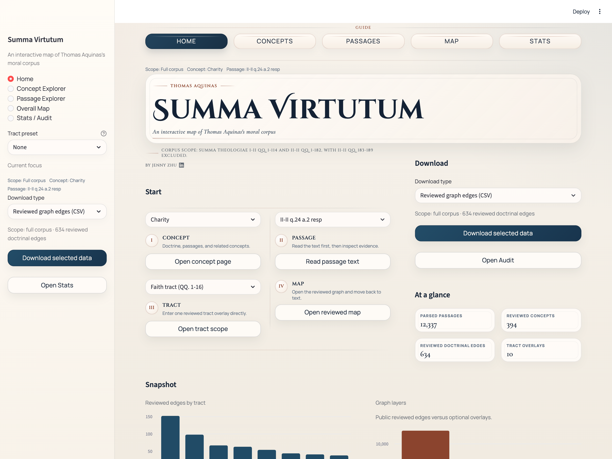
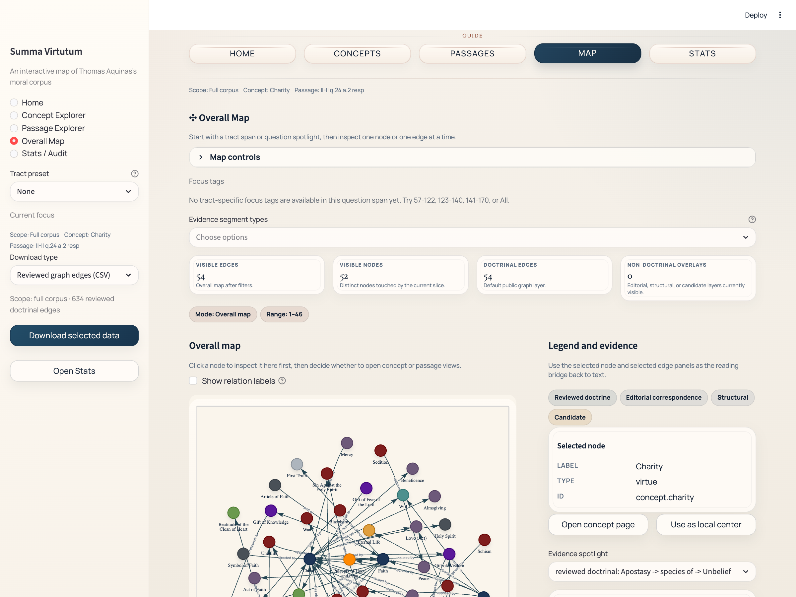

# Summa Virtue Alignment

Evidence-first dataset, minimal SFT demonstration, and audit surface for training
Aquinas-grounded Christian virtue assistants from reviewed passage-level supervision in the moral
corpus of Thomas Aquinas's *Summa Theologiae*.

This public release is organized around three things: a reviewed Christian virtue dataset, a
reproducible local fine-tuning path, and an inspectable theological evidence trail back to Aquinas's
text, built on the evidence model and corpus work of Summa Moral Graph.

[](./docs/fine_tune_with_summa_moral_graph.md)
[](https://huggingface.co/JennyZhu0822/summa-virtue-qwen2.5-1.5b)
[](https://summa-moral-graph.streamlit.app/)


> This repo is a public research release for Thomist moral virtue alignment.
>
> Minimal example, not ceiling: the released `Qwen/Qwen2.5-1.5B-Instruct` LoRA adapter is a
> deliberately small Apple-Silicon run. Its job is to prove that the dataset, training loop, and
> evaluation surface work end to end on reviewed evidence. It is not the strongest achievable final
> model.
>
> Source: [GitHub](https://github.com/hanzhenzhujene/summa-virtue-alignment) · by
> [Jenny Zhu](https://www.linkedin.com/in/hanzhen-zhu/)

## Repository At A Glance

| Dimension | Public answer |
| --- | --- |
| Core artifact | An evidence-first Christian virtue dataset and SFT workflow grounded in Aquinas's moral corpus |
| Theological target | A Thomist moral virtue assistant that reasons within Aquinas's categories rather than generic religion chat |
| Canonical local demo | `Qwen/Qwen2.5-1.5B-Instruct` LoRA on Apple Silicon `mps`, published as a minimal example rather than a final ceiling |
| What a reviewer can inspect | Dataset exports, held-out benchmarks, curated report, released adapter, and live evidence browser |
| Where to start | [Fine-tuning guide](./docs/fine_tune_with_summa_moral_graph.md) · [Flagship report](./docs/reports/christian_virtue_qwen2_5_1_5b_local_baseline_report.md) · [Repository map](./docs/repository_map.md) |

## Three Purposes

This repo has three public purposes, and each one is visible in the repository itself:

| Purpose | What it means here | Why it matters |
| --- | --- | --- |
| Curate reviewed Thomist virtue supervision | The dataset is built from approved doctrinal annotations joined back to stable `resp` / `ad` passage ids. | The model is trained on inspectable moral-theological evidence rather than on vague religion text. |
| Demonstrate a minimal but real SFT example | The public `Qwen/Qwen2.5-1.5B-Instruct` run is intentionally small and fully reproducible on Apple Silicon. | A new reader can verify the pipeline works end to end without needing a large GPU budget. |
| Preserve a theological audit trail | The repo includes held-out benchmarks, a curated report, a released adapter, and a live evidence browser. | Readers can inspect what the model was taught, what improved, and what remains limited. |

## Theological Grounding

This repo is not grounded in generic religious language. It is grounded in Aquinas's treatment of
the moral virtues and their relations in the *Summa Theologiae*.

Representative doctrinal anchors:

| Theme | Aquinas locus | Why it matters for the SFT |
| --- | --- | --- |
| Charity considered in itself | [II-II q.23 a.1, “Is charity friendship?”](https://www.newadvent.org/summa/3023.htm#article1) | Anchors the theological-virtue tract in Aquinas's own account of charity. |
| Fraternal correction as an act of charity | [II-II q.33 a.1](https://www.newadvent.org/summa/3033.htm#article1) | Grounds one of the repo's representative act-of-charity relation examples. |
| Prudence considered in itself | [II-II q.47 a.1](https://www.newadvent.org/summa/3047.htm#article1) | Anchors the prudence tract in Aquinas's account of practical reason. |
| Justice | [II-II q.58 a.1, “What is justice?”](https://www.newadvent.org/summa/3058.htm#article1) | Grounds the justice tract in Aquinas's formal account of justice. |
| Restitution as an act of commutative justice | [II-II q.62 a.1](https://www.newadvent.org/summa/3062.htm#article1) | Grounds one of the clearest justice-act relations in the dataset and demo panel. |
| Fortitude | [II-II q.123 a.1](https://www.newadvent.org/summa/3123.htm#article1) | Anchors the fortitude tract in Aquinas's account of virtue under difficulty. |
| Temperance | [II-II q.141 a.1](https://www.newadvent.org/summa/3141.htm#article1) | Anchors the temperance tract in Aquinas's account of moral moderation. |

These source links are not decorative. They indicate the kind of doctrinal loci the dataset is
trying to teach the model to handle prudently: virtue definitions, act relations, and tract-local
distinctions that remain tethered to Aquinas's own text.

## Start Here

| I want to... | Start here |
| --- | --- |
| Reproduce the minimal public baseline | `make setup-christian-virtue-local` then `make reproduce-christian-virtue-qwen2-5-1-5b-local` |
| Understand the training goal and method | [docs/fine_tune_with_summa_moral_graph.md](./docs/fine_tune_with_summa_moral_graph.md) |
| Inspect the strongest research evidence | [Flagship report](./docs/reports/christian_virtue_qwen2_5_1_5b_local_baseline_report.md) |
| Inspect the published model artifact | [Hugging Face adapter](https://huggingface.co/JennyZhu0822/summa-virtue-qwen2.5-1.5b) · [GitHub release](https://github.com/hanzhenzhujene/summa-virtue-alignment/releases/tag/christian-virtue-qwen2.5-1.5b-local-baseline-20260418_193038) |
| Audit the underlying passages and graph | [Live viewer](https://summa-moral-graph.streamlit.app/) |

## Why This Repo Exists

From first principles, supervised fine-tuning only helps when the supervision actually matches the
behavior you want.

If the target behavior is Thomist moral virtue reasoning, then the training signal must be:

- doctrinally coherent rather than theologically generic
- passage-grounded rather than article-blob supervision
- reviewed rather than candidate-level guesswork
- inspectable after training rather than hidden behind opaque preprocessing

Generic religion corpora are too broad for that target. Raw article dumps are too coarse. Candidate
annotations are too noisy. Summa Moral Graph exists to solve that problem with a reviewed,
segment-grounded Christian virtue dataset tied to Aquinas's moral corpus.

## What This Repo Contributes

| Surface | What it is | Why it matters |
| --- | --- | --- |
| Christian virtue SFT dataset | `555` reviewed doctrinal annotations turned into `1883` chat-style examples | Gives a reusable supervised signal for Thomist moral virtue alignment |
| Minimal local proof-of-pipeline | A reproducible `Qwen/Qwen2.5-1.5B-Instruct` LoRA run on Apple Silicon `mps` | Shows the method works end to end on ordinary hardware |
| Public evaluation and release surface | Held-out benchmarks, curated report, Hugging Face adapter, GitHub release | Makes the research claim inspectable rather than aspirational |
| Evidence browser | Streamlit app for passages, concepts, relations, and graph slices | Lets a reader audit what the model is being trained from |

## SFT Purpose: Thomist Moral Virtue Alignment

The goal is not to build a generic theology chatbot, a devotional assistant, or a pious citation
emitter.

The goal is to align a model to Thomist moral virtue: the moral architecture Aquinas develops
across the theological virtues, prudence, justice, fortitude, temperance, their acts, objects,
parts, opposed vices, and tract-local doctrinal relations.

In plainer terms: the model should learn to answer moral-virtue questions as Aquinas organizes
them, not merely to sound religious or to drop medieval vocabulary.

A successful model in this repo should be able to do things like:

- explain what prudence is in Aquinas's framework
- distinguish a virtue from its act, object, part, or opposed vice
- explain why charity has fraternal correction as an act
- explain why restitution belongs to commutative justice
- stay inside reviewed textual support rather than drifting into generic moralizing

In scope:

- Aquinas-grounded explanations of virtues, vices, acts, parts, and oppositions
- evidence-bounded doctrinal QA
- citation traceability back to stable passage ids

Out of scope:

- generic religion chat
- unconstrained pastoral or spiritual advice
- candidate material or structural-editorial review treated as training truth
- objections and `sed contra` used as default doctrinal supervision

Because Aquinas's own answer in the *Summa* is carried chiefly by the `resp` and `ad` segments,
those are the default doctrinal evidence units in this repo. Opening objections and `sed contra`
are parsed for article structure, but they are not promoted into the default SFT supervision layer.

## Why This Dataset Is Worth Using

From first principles, a good SFT dataset is valuable when its signal quality is high even if its
scale is modest. The strength of this dataset is not just that it exists; it is that its evidence
policy is explicit and disciplined.

| Design choice | Why it matters |
| --- | --- |
| Segment id is the evidence unit | Keeps supervision attached to precise textual support instead of vague article-level blobs |
| Only approved reviewed doctrinal annotations are used | Avoids silently training on speculative or candidate material |
| `resp` and `ad` only by default | Centers supervision on Aquinas's own answer rather than surrounding article structure |
| Stable ids survive end to end | Makes reports, predictions, and model outputs auditable back to source passages |
| Grouped `question_id` splits | Reduces leakage across train and held-out evaluation |
| Prompt-only benchmark exports | Keeps held-out inference honest by removing the gold assistant answer from generation input |

## Dataset Snapshot

### Corpus Surface

- `296` questions
- `1482` articles
- `6032` doctrinally usable `resp`/`ad` segments

### Virtue-Centered SFT Export

- dataset: [data/processed/sft/exports/christian_virtue_v1](./data/processed/sft/exports/christian_virtue_v1)
- optional OOD companion:
  [data/processed/sft/exports/christian_virtue_v1_ood](./data/processed/sft/exports/christian_virtue_v1_ood)
- `555` approved doctrinal source annotations
- `1883` SFT examples
- split sizes: `1475` train, `175` val, `233` test
- default grouping key: `question_id`

The v1 doctrinal scope is virtue-centered: theological virtues, prudence, justice core, connected
virtues, fortitude parts and closure, and temperance parts and closure.

### Task Families

| Task family | Count | What it teaches |
| --- | ---: | --- |
| Passage-grounded doctrinal QA | `555` | Answer from a cited passage without leaving the evidence |
| Reviewed relation explanation | `555` | Explain subject-relation-object claims in natural language |
| Citation-grounded moral answer | `555` | Answer user-style moral questions with explicit passage traceability |
| Virtue concept explanation | `218` | Explain a virtue, vice, act, or part relation from supporting passages |

## Minimal Local Example: Qwen2.5-1.5B

The canonical public baseline is a minimal example.

| Property | Value |
| --- | --- |
| Base model | `Qwen/Qwen2.5-1.5B-Instruct` |
| Training method | LoRA on Apple Silicon `mps`, `float16`, no quantization |
| Public rung | `local-baseline` |
| Train subset | `128` examples |
| Eval subset | `16` examples |
| Max steps | `20` |
| Runtime goal | Honest end-to-end reproducibility on a 16 GB laptop |

This is the smallest serious baseline we can ask a new user to reproduce locally.

This is not the strongest achievable final model.

What it proves:

- the reviewed dataset can move model behavior in the right Thomist direction
- the local train / infer / eval / report / package loop is real, not aspirational
- the repo is usable as a public fine-tuning template

What it does not prove:

- that `1.5B` is the intended final deployment size
- that local Apple-Silicon training is the best path for strongest model quality
- that citation exact match is the whole theological evaluation story

## What The Minimal Example Actually Shows

Automatic metric shown below: exact citation match on held-out prompts. In this repo, that metric
is a useful guardrail for evidence-bounded Thomist answering, but it is not the whole purpose of
the SFT.

Headline held-out `test` result on `233` prompts:

- overall citation exact: `0.000` on base -> `0.150` on adapter

Goal-aligned Thomist moral virtue slices:

| Held-out slice | Base | Adapter | Delta |
| --- | ---: | ---: | ---: |
| Virtue concept explanation | `0.0%` | `50.0%` | `+50.0%` |
| Reviewed relation explanation | `0.0%` | `19.4%` | `+19.4%` |
| Passage-grounded doctrinal QA | `0.0%` | `9.0%` | `+9.0%` |
| Goal-demo exact citations | `0 / 12` | `3 / 12` | `+3` |

Why this is meaningful:

- base is `0.0%` across the public goal-aligned slices, so the adapter is not merely preserving an
  already-good baseline
- the adapter improves every public goal-aligned slice we foreground in the README
- this happens in a deliberately minimal example, which makes the dataset and method more credible
  as a reusable template

Read prudently, this result supports a modest but important claim: the supervision is strong enough
to move a small general model toward better Thomist moral-virtue behavior. It does not yet settle
the larger question of how far the same method can be pushed on larger models and longer runs.

#### Training Trace


*Figure 1. Loss and mean token accuracy across the canonical `local-baseline` local run. The point of
this figure is not state-of-the-art scale; it is to show a stable, inspectable optimization trace
for the minimal public example.*

#### Held-Out Improvement


*Figure 2. Held-out exact citation match for the untouched base model versus the LoRA adapter,
restricted to goal-aligned virtue task families. This is the central public empirical claim of the
repo: even a minimal example can align model behavior toward Thomist moral virtue reasoning.*

If you want the full breakdown, including tract-wise slices and qualitative examples, go directly
to the
[flagship report](./docs/reports/christian_virtue_qwen2_5_1_5b_local_baseline_report.md).

## Reproduce The Minimal Example

The canonical public path is intentionally short:

```bash
make setup-christian-virtue-local
make reproduce-christian-virtue-qwen2-5-1-5b-local
make public-release-check
```

What these commands do:

- `make setup-christian-virtue-local`
  - creates `.venv`
  - installs the pinned Apple-Silicon environment from
    [requirements/local-mps-py312.lock.txt](./requirements/local-mps-py312.lock.txt)
- `make reproduce-christian-virtue-qwen2-5-1-5b-local`
  - rebuilds the dataset if needed
  - runs `smoke`
  - runs the canonical `local-baseline` train
  - generates base and adapter held-out predictions
  - compares them and rebuilds the curated report
- `make public-release-check`
  - runs `ruff`
  - runs `mypy`
  - runs the targeted publication-surface tests
  - verifies repo/package coherence for the published Christian virtue release

Expected outputs land under:

- `runs/christian_virtue/qwen2_5_1_5b_instruct/`
- `docs/reports/christian_virtue_qwen2_5_1_5b_local_baseline_report.md`
- `artifacts/christian_virtue/qwen2_5_1_5b_instruct/local_baseline_adapter/`

For the full stepwise path, model swapping guide, and remote CUDA path, see
[docs/fine_tune_with_summa_moral_graph.md](./docs/fine_tune_with_summa_moral_graph.md).

## Public Artifacts

- Hugging Face adapter:
  [JennyZhu0822/summa-virtue-qwen2.5-1.5b](https://huggingface.co/JennyZhu0822/summa-virtue-qwen2.5-1.5b)
- Matching GitHub release:
  [christian-virtue-qwen2.5-1.5b-local-baseline-20260418_193038](https://github.com/hanzhenzhujene/summa-virtue-alignment/releases/tag/christian-virtue-qwen2.5-1.5b-local-baseline-20260418_193038)
- Curated experiment report:
  [docs/reports/christian_virtue_qwen2_5_1_5b_local_baseline_report.md](./docs/reports/christian_virtue_qwen2_5_1_5b_local_baseline_report.md)
- Dataset card:
  [docs/christian_virtue_dataset_card.md](./docs/christian_virtue_dataset_card.md)
- Fine-tuning guide:
  [docs/fine_tune_with_summa_moral_graph.md](./docs/fine_tune_with_summa_moral_graph.md)
- Maintainer workflow:
  [docs/christian_virtue_sft.md](./docs/christian_virtue_sft.md)

## Fine-Tune Your Model With Summa Moral Graph

If you want to train your own model on the same evidence-first supervision, this repo is the
public entrypoint.

Start with:

- [docs/fine_tune_with_summa_moral_graph.md](./docs/fine_tune_with_summa_moral_graph.md)
- [docs/christian_virtue_dataset_card.md](./docs/christian_virtue_dataset_card.md)
- [data/processed/sft/exports/christian_virtue_v1](./data/processed/sft/exports/christian_virtue_v1)
- [data/processed/sft/exports/christian_virtue_v1_ood](./data/processed/sft/exports/christian_virtue_v1_ood)

The smallest model-swap contract is:

- `model_name_or_path`
- `lora_target_modules`
- `runtime_backend`
- `torch_dtype`
- `max_seq_length`

## Use Cases And Non-Goals

Good use cases:

- training a citation-aware Thomist moral virtue assistant
- benchmarking whether a model can stay inside Aquinas's moral categories
- comparing base vs adapter behavior on structured doctrinal tasks
- reusing the same dataset and eval loop with larger local or remote models

Not the intended use:

- generic religion chat
- broad catechetical coverage outside the repo's virtue-centered doctrinal scope
- pastoral counseling or spiritual direction
- training on candidate or structural-editorial material as if it were approved doctrine

## Repository Structure

```text
configs/
  sft/          dataset-build configs
  train/        local and remote training configs
  inference/    base and adapter generation configs
docs/
  fine_tune_with_summa_moral_graph.md
  christian_virtue_sft.md
  christian_virtue_dataset_card.md
  repository_map.md
  reports/
scripts/
  build_christian_virtue_sft_dataset.py
  train_christian_virtue_qlora.py
  generate_christian_virtue_predictions.py
  eval_christian_virtue_sft.py
  run_christian_virtue_qwen2_5_1_5b_local_*.sh
  README.md
src/summa_moral_graph/
  annotations/  tract-specific reviewed overlays and specs
  ingest/       textual parsing and normalization
  sft/          dataset, runtime, evaluation, reporting, publication
  viewer/       unified Streamlit shell
data/
  interim/      canonical segment/article/question spine
  gold/         reviewed doctrinal and structural-editorial annotations
  processed/sft/exports/
  candidate/    review material kept separate from approved doctrine
tests/
  test_sft_*    SFT builder/runtime/report/publication coverage
```

For a fuller guided tour, see [docs/repository_map.md](./docs/repository_map.md).
For a grouped entrypoint guide, see [scripts/README.md](./scripts/README.md).

## Evidence Browser

**Live app:** [summa-moral-graph.streamlit.app](https://summa-moral-graph.streamlit.app/)

The Streamlit entrypoint is [streamlit_app.py](./streamlit_app.py).

| Dashboard home | Overall map |
| --- | --- |
|  |  |
| _Landing view with concept, passage, tract, and map entry routes._ | _Graph view with doctrinal edges, evidence panel, and current-slice controls._ |

The viewer is the companion evidence surface for the SFT work. It lets a reader move from concept
to relation to segment to graph while keeping the underlying reviewed evidence visible.

Run it locally with:

```bash
make app
```

or:

```bash
python3.12 -m venv .venv
source .venv/bin/activate
pip install -e ".[dev]"
PYTHONPATH=src ./.venv/bin/streamlit run streamlit_app.py
```

## Corpus Scope

The textual spine currently covers:

- `I-II, qq. 1–114`
- `II-II, qq. 1–182`

Explicit exclusions:

- `II-II, qq. 183–189`
- `Part I`
- `Part III`
- `Supplement`

## Current Reviewed Coverage

The repo does not claim the whole corpus is doctrinally reviewed.

It currently includes reviewed overlays for:

- initial reviewed vertical slice across selected `I-II` and `II-II` questions
- theological virtues: `II-II, qq. 1–46`
- prudence: `II-II, qq. 47–56`
- justice core: `II-II, qq. 57–79`
- religion tract: `II-II, qq. 80–100`
- owed-relation tract: `II-II, qq. 101–108`
- connected virtues: `II-II, qq. 109–120`
- fortitude parts and closure: `II-II, qq. 129–140`
- temperance: `II-II, qq. 141–170`

Questions `II-II, qq. 121–128` remain structurally present in the corpus but do not yet have their
own dedicated reviewed doctrinal block.

## Evidence Discipline

This repository is designed around a few non-negotiable rules:

- the canonical evidence unit is the segment, not the whole article
- stable ids remain the anchor for every exported record
- reviewed doctrine, editorial correspondences, structural links, and candidate material stay
  separate in data, validation, and UI
- candidate material is never auto-promoted into reviewed doctrine
- alias handling is conservative, especially where one English label could hide multiple Thomistic
  concepts

In practice, the app defaults to reviewed doctrinal graph material, and the SFT pipeline defaults
to approved doctrinal supervision only.

## Where To Go Next

- schema and data model: [docs/schema.md](./docs/schema.md)
- annotation guide: [docs/annotation_guide.md](./docs/annotation_guide.md)
- full-corpus workflow: [docs/full_corpus_workflow.md](./docs/full_corpus_workflow.md)
- review queue guide: [docs/review_queue_guide.md](./docs/review_queue_guide.md)
- dashboard interaction audit:
  [docs/dashboard_interaction_audit.md](./docs/dashboard_interaction_audit.md)
