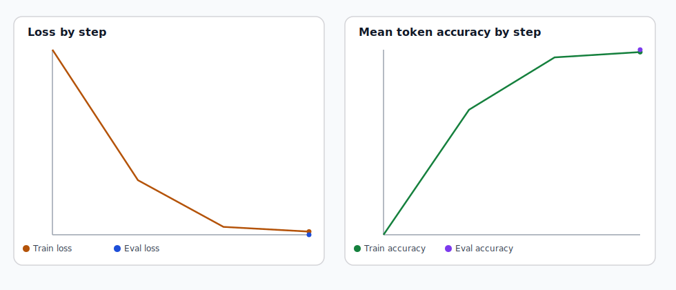

# Summa Virtutum

Evidence-first graph and fine-tuning infrastructure for Thomas Aquinas's moral corpus in the
*Summa Theologiae*.

[](https://summa-moral-graph.streamlit.app/)


> Passage-grounded concept, relation, and graph navigation across Aquinas's moral corpus, plus a
> reproducible Christian virtue SFT baseline built from reviewed doctrinal annotations.
>
> Source: [GitHub](https://github.com/hanzhenzhujene/summa-moral-graph-fork) · by
> [Jenny Zhu](https://www.linkedin.com/in/hanzhen-zhu/)

## What This Repo Is

This repository has two tightly connected research products:

1. an interactive evidence-first viewer for Aquinas's moral corpus
2. a reproducible fine-tuning pipeline for an Aquinas-grounded Christian virtue assistant

The core research problem is the same in both surfaces: how to move from concept to relation to
passage to model behavior without losing textual grounding.

In the Summa article form, this repo keeps only `resp` and `ad` segments as doctrinal evidence.
Opening objections and `sed contra` material are parsed for structure, but they are not promoted
into the doctrinal evidence layer used by the viewer or the default SFT dataset.

## Method At A Glance

The repository is organized around five non-negotiable design choices:

- the canonical evidence unit is the segment id, not the whole article
- stable ids stay attached from `data/interim/` through dataset exports, reports, and model runs
- reviewed doctrinal, structural-editorial, structural, and candidate layers remain separate
- candidate material is never auto-promoted into approved truth
- the local demonstration path is intentionally modest and reproducible rather than hardware-maximal

For the Christian virtue SFT release, the default builder:

- reads the canonical textual spine from `data/interim/`
- joins only approved doctrinal annotations from selected virtue tracts in `data/gold/`
- filters to `explicit_textual` and `strong_textual_inference`
- emits four instruction families with stable passage ids and citation labels
- evaluates base and adapter models on held-out prompt-only benchmarks

## Key Results

### Corpus Surface

- `296` questions
- `1482` articles
- `6032` doctrinally usable `resp`/`ad` segments

### Christian Virtue Dataset

- `555` approved doctrinal source annotations
- `1883` SFT examples
- split sizes: `1475` train, `175` val, `233` test
- task families:
  - `555` passage-grounded doctrinal QA
  - `555` reviewed relation explanation
  - `555` citation-grounded moral answer
  - `218` virtue concept explanation

### Canonical Local Baseline

- model: `Qwen/Qwen2.5-1.5B-Instruct`
- method: LoRA on Apple Silicon `mps`
- official local rung: `pilot-lite`
- held-out `test` citation exact match:
  - base: `0.000`
  - adapter: `0.150`
  - gain: `+0.150`

The purpose of this SFT is not merely to copy citation strings. The target behavior is an
Aquinas-grounded Christian virtue assistant that answers within reviewed evidence, uses Aquinas's
moral categories, and preserves source traceability.

### Why This SFT Counts As A Real Win

The local `pilot-lite` baseline is intentionally modest, but the result is still clear: the
adapter learns a real task-specific behavior shift over the untouched base model. The optimization
trace is stable, and the held-out benchmark moves in the right direction on the most structured,
evidence-grounded task families.

| Held-out `test` slice | Base | Adapter | Delta |
| --- | ---: | ---: | ---: |
| Overall citation exact | `0.0%` | `15.0%` | `+15.0%` |
| Virtue concept explanation | `0.0%` | `50.0%` | `+50.0%` |
| Reviewed relation explanation | `0.0%` | `19.4%` | `+19.4%` |
| Passage-grounded doctrinal QA | `0.0%` | `9.0%` | `+9.0%` |
| Goal-demo exact citations | `0 / 12` | `3 / 12` | `+3` |

| Training trace | Held-out improvement |
| --- | --- |
|  |  |
| Stable local optimization on `mps`: loss falls, token accuracy rises, and the run completes in about `4.7` minutes. | The adapter improves the overall held-out benchmark and shows the strongest gains on virtue-concept and reviewed-relation tasks. |

If you want the full breakdown, including tract-wise slices and qualitative successes/failures, go
straight to the flagship report:
[docs/reports/christian_virtue_qwen2_5_1_5b_pilot_lite_report.md](./docs/reports/christian_virtue_qwen2_5_1_5b_pilot_lite_report.md).

## Reproduce The Canonical Local Result

The official public reproduction path is the local Apple-Silicon `pilot-lite` baseline.

### 1. Setup

This command creates `.venv`, installs the pinned local lockfile, and then installs the repo in
editable mode without re-resolving dependencies:

```bash
make setup-christian-virtue-local
```

The canonical lockfile lives at
[requirements/local-mps-py312.lock.txt](./requirements/local-mps-py312.lock.txt).

### 2. Run The Full Local Research Loop

This command rebuilds the dataset if needed, runs `smoke`, runs the canonical `pilot-lite` train,
generates base and adapter predictions on held-out `test`, compares them, rebuilds the curated
report, and runs the publication verification gate:

```bash
make reproduce-christian-virtue-qwen2-5-1-5b-local
```

If you want the stepwise path instead of the one-command path:

```bash
make build-christian-virtue-sft
make train-christian-virtue-qwen2-5-1-5b-local-smoke
make train-christian-virtue-qwen2-5-1-5b-local-pilot-lite
make eval-christian-virtue-qwen2-5-1-5b-local-base-test
make eval-christian-virtue-qwen2-5-1-5b-local-adapter-test
make compare-christian-virtue-qwen2-5-1-5b-local-test
make report-christian-virtue-qwen2-5-1-5b-local-pilot-lite
make verify-christian-virtue-qwen2-5-1-5b-local-publishable
```

Expected outputs land under:

- `runs/christian_virtue/qwen2_5_1_5b_instruct/`
- `docs/reports/christian_virtue_qwen2_5_1_5b_pilot_lite_report.md`
- `artifacts/christian_virtue/qwen2_5_1_5b_instruct/pilot_lite_adapter/`

## Public Artifacts

- Hugging Face adapter:
  [JennyZhu0822/summa-moral-graph-qwen2.5-1.5b-pilot-lite](https://huggingface.co/JennyZhu0822/summa-moral-graph-qwen2.5-1.5b-pilot-lite)
- Matching GitHub release:
  [christian-virtue-qwen2.5-1.5b-pilot-lite-20260418_193038](https://github.com/hanzhenzhujene/summa-moral-graph-fork/releases/tag/christian-virtue-qwen2.5-1.5b-pilot-lite-20260418_193038)
- Curated experiment report:
  [docs/reports/christian_virtue_qwen2_5_1_5b_pilot_lite_report.md](./docs/reports/christian_virtue_qwen2_5_1_5b_pilot_lite_report.md)
- Fine-tuning guide:
  [docs/fine_tune_with_summa_moral_graph.md](./docs/fine_tune_with_summa_moral_graph.md)
- Maintainer workflow:
  [docs/christian_virtue_sft.md](./docs/christian_virtue_sft.md)
- Dataset card:
  [docs/christian_virtue_dataset_card.md](./docs/christian_virtue_dataset_card.md)
- Repository map:
  [docs/repository_map.md](./docs/repository_map.md)

## Repository Structure

```text
configs/
  sft/          dataset-build configs
  train/        local and remote training configs
  inference/    base and adapter generation configs
docs/
  fine_tune_with_summa_moral_graph.md
  christian_virtue_sft.md
  christian_virtue_dataset_card.md
  repository_map.md
  reports/
scripts/
  build_christian_virtue_sft_dataset.py
  train_christian_virtue_qlora.py
  generate_christian_virtue_predictions.py
  eval_christian_virtue_sft.py
  run_christian_virtue_qwen2_5_1_5b_local_*.sh
src/summa_moral_graph/
  annotations/  tract-specific reviewed overlays and specs
  ingest/       textual parsing and normalization
  sft/          dataset, runtime, evaluation, reporting, publication
  viewer/       unified Streamlit shell
data/
  interim/      canonical segment/article/question spine
  gold/         reviewed doctrinal and structural-editorial annotations
  processed/sft/exports/
  candidate/    review material kept separate from approved doctrine
tests/
  test_sft_*    SFT builder/runtime/report/publication coverage
```

For a fuller guided tour, see [docs/repository_map.md](./docs/repository_map.md).

## Fine-Tune Your Model With Summa Moral Graph

This repo is the public fine-tuning entrypoint for the Christian virtue SFT pipeline.

The intended outcome is not a generic theology chatbot. It is a model that can:

- explain virtue, vice, act, object, part, and opposition in Aquinas's categories
- answer within reviewed doctrinal evidence
- preserve stable passage-id traceability
- give other researchers a concrete, inspectable adaptation recipe

The committed public dataset exports live directly in the repo:

- [data/processed/sft/exports/christian_virtue_v1](./data/processed/sft/exports/christian_virtue_v1)
- [data/processed/sft/exports/christian_virtue_v1_ood](./data/processed/sft/exports/christian_virtue_v1_ood)

Start here:

- public guide: [docs/fine_tune_with_summa_moral_graph.md](./docs/fine_tune_with_summa_moral_graph.md)
- dataset card: [docs/christian_virtue_dataset_card.md](./docs/christian_virtue_dataset_card.md)
- flagship report:
  [docs/reports/christian_virtue_qwen2_5_1_5b_pilot_lite_report.md](./docs/reports/christian_virtue_qwen2_5_1_5b_pilot_lite_report.md)

## Open The Viewer

**Live app:** [summa-moral-graph.streamlit.app](https://summa-moral-graph.streamlit.app/)

The Streamlit entrypoint is [streamlit_app.py](./streamlit_app.py).

| Dashboard home | Overall map |
| --- | --- |
|  |  |
| _Landing view with concept, passage, tract, and map entry routes._ | _Graph view with doctrinal edges, evidence panel, and current-slice controls._ |

The viewer is built to be read, not merely queried. It lets a user move from concept to relation to
segment to graph while keeping the underlying evidence visible.

Run it locally with:

```bash
make app
```

or:

```bash
python3.12 -m venv .venv
source .venv/bin/activate
pip install -e ".[dev]"
PYTHONPATH=src ./.venv/bin/streamlit run streamlit_app.py
```

## Corpus Scope

The textual spine currently covers:

- `I-II, qq. 1–114`
- `II-II, qq. 1–182`

Explicit exclusions:

- `II-II, qq. 183–189`
- `Part I`
- `Part III`
- `Supplement`

## Current Reviewed Coverage

The repo does not claim the whole corpus is doctrinally reviewed.

It currently includes reviewed overlays for:

- pilot vertical slice across selected `I-II` and `II-II` questions
- theological virtues: `II-II, qq. 1–46`
- prudence: `II-II, qq. 47–56`
- justice core: `II-II, qq. 57–79`
- religion tract: `II-II, qq. 80–100`
- owed-relation tract: `II-II, qq. 101–108`
- connected virtues: `II-II, qq. 109–120`
- fortitude parts and closure: `II-II, qq. 129–140`
- temperance: `II-II, qq. 141–170`

Questions `II-II, qq. 121–128` remain structurally present in the corpus but do not yet have their
own dedicated reviewed doctrinal block.

## Evidence Discipline

This repository is designed around a few non-negotiable rules:

- the canonical evidence unit is the segment, not the whole article
- stable ids remain the anchor for every exported record
- reviewed doctrine, editorial correspondences, structural links, and candidate material stay
  separate in data, validation, and UI
- candidate material is never auto-promoted into reviewed doctrine
- alias handling is conservative, especially where one English label could hide multiple Thomistic
  concepts

In practice, the app defaults to reviewed doctrinal graph material, and the SFT pipeline defaults
to approved doctrinal supervision only.

## Where To Go Next

- schema and data model: [docs/schema.md](./docs/schema.md)
- annotation guide: [docs/annotation_guide.md](./docs/annotation_guide.md)
- full-corpus workflow: [docs/full_corpus_workflow.md](./docs/full_corpus_workflow.md)
- review queue guide: [docs/review_queue_guide.md](./docs/review_queue_guide.md)
- dashboard interaction audit:
  [docs/dashboard_interaction_audit.md](./docs/dashboard_interaction_audit.md)
