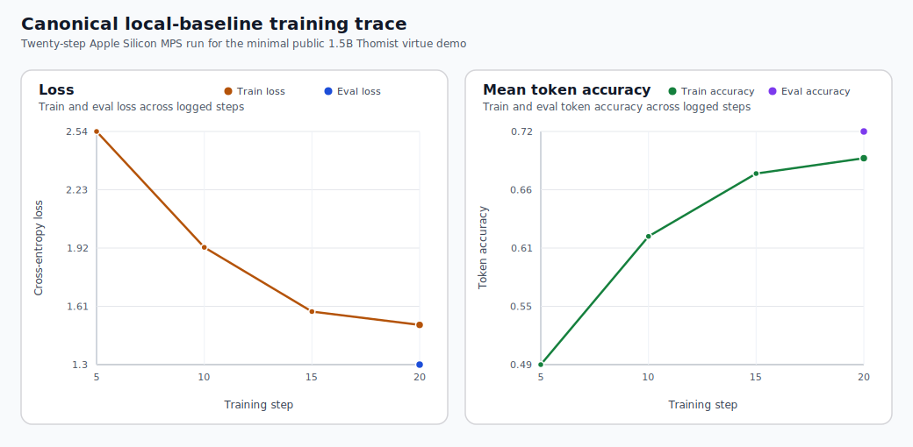
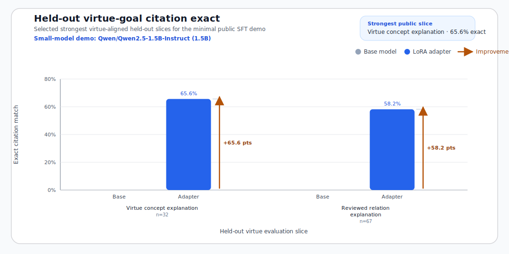

# Summa Virtue Alignment

Evidence-first Christian virtue dataset, minimal SFT demonstration, and audit surface for Thomist
moral virtue alignment, built on the corpus and evidence model of Summa Moral Graph.

This repo packages one public research release: a reviewed Christian virtue dataset, a reproducible
local fine-tuning path, and an inspectable theological trail back to Aquinas's text.

The dataset exists to train models toward Aquinas-grounded Christian virtue reasoning rather than
generic religion chat, and its main merit is that the supervision stays reviewed, passage-grounded,
relational, and auditable end to end.

[](./docs/fine_tune_with_summa_moral_graph.md)
[](https://huggingface.co/JennyZhu0822/summa-virtue-qwen2.5-1.5b)
[](https://summa-moral-graph.streamlit.app/)
[](https://github.com/hanzhenzhujene/summa-virtue-alignment/actions/workflows/public-release-check.yml)

| Start here | Companion graph |
| --- | --- |
| [**SFT guide**](./docs/fine_tune_with_summa_moral_graph.md) · [**Published adapter**](https://huggingface.co/JennyZhu0822/summa-virtue-qwen2.5-1.5b) | [**Summa Moral Graph**](https://github.com/hanzhenzhujene/summa-moral-graph) · [**Live viewer**](https://summa-moral-graph.streamlit.app/) |
| Reproduce the public baseline or reuse the committed dataset export. | Audit the same passages, concepts, and reviewed relations in the companion dashboard. |

> Minimal example, not ceiling: the released `Qwen/Qwen2.5-1.5B-Instruct` LoRA adapter is a
> deliberately small Apple-Silicon run. Its job is to prove that the dataset, training loop, and
> evaluation surface work end to end on reviewed evidence. It is not the strongest achievable final model.

## What This Repo Is For

This repo serves three linked purposes:

- **Dataset:** a reviewed Christian virtue SFT export built from approved doctrinal annotations
  joined back to stable Aquinas passage ids.
- **Training demo:** a reproducible local `Qwen/Qwen2.5-1.5B-Instruct` LoRA baseline showing that
  the dataset can move model behavior in the right Thomist direction.
- **Audit surface:** reports, figures, package artifacts, and the companion graph viewer so a
  reader can inspect claims back to the text.

## Dataset Merit

This dataset matters because the training truth stays unusually clean and inspectable all the way
through the pipeline:

- stable passage ids survive from the reviewed annotation layer into the final SFT examples
- reviewed doctrinal relations stay separate from candidate material, structural links, and
  editorial cleanup
- Aquinas-specific categories such as virtue, vice, act, part, and opposition remain explicit
  instead of being flattened into generic religion text

## Method Overview

| Stage | What the repo does | Surface |
| --- | --- | --- |
| Evidence | Joins approved doctrinal annotations back to stable `resp` / `ad` passage ids instead of flattening Aquinas into unlabeled text blobs | [dataset export](./data/processed/sft/exports/christian_virtue_v1) |
| Supervision | Builds four instruction families: doctrinal QA, reviewed relation explanation, virtue concept explanation, and citation-grounded moral answer | [templates](./src/summa_moral_graph/sft/templates.py) |
| Training | Runs a deliberately small local LoRA baseline on `Qwen/Qwen2.5-1.5B-Instruct` to prove the pipeline works end to end on reviewed evidence | [train config](./configs/train/qwen2_5_1_5b_instruct_lora_mps_local_baseline.yaml) |
| Evaluation | Compares untouched base vs adapter on held-out prompts, then reports tract and task-family behavior | [baseline report](./docs/reports/christian_virtue_qwen2_5_1_5b_local_baseline_report.md) |
| Audit | Preserves stable ids, reports, package metadata, and the companion viewer so claims can be checked back against Aquinas's text | [frontier audit](./docs/reports/christian_virtue_citation_frontier_audit.md) |

## Repository Structure

| Path | Role |
| --- | --- |
| [data/](./data/) | Canonical text spine, reviewed annotations, candidates, and committed Christian virtue SFT exports |
| [src/summa_moral_graph/sft/](./src/summa_moral_graph/sft/) | Dataset building, training, inference, evaluation, reporting, and publication logic |
| [scripts/](./scripts/) | Public entrypoints for setup, local training, evaluation, reporting, and publication checks |
| [docs/reports/](./docs/reports/) | Curated experiment reports, audit notes, and publication figures |
| [artifacts/christian_virtue/](./artifacts/christian_virtue/) | Packaged adapter surface mirrored to the public release |
| [docs/public_claim_map.md](./docs/public_claim_map.md) | Explicit map from public claim to artifact, command, and claim boundary |
| [docs/repository_map.md](./docs/repository_map.md) | Shortest full orientation guide for reviewers and collaborators |

## Training Demo

This training demo asks a direct question: can reviewed Christian virtue supervision move a small
general model toward better Thomist moral virtue behavior on held-out prompts?

| Public highlight | Base | Adapter | Delta |
| --- | ---: | ---: | ---: |
| Held-out benchmark exact citation | `0.0%` | `36.5%` | `+36.5%` |
| Virtue concept explanation | `0.0%` | `65.6%` | `+65.6%` |
| Reviewed relation explanation | `0.0%` | `62.7%` | `+62.7%` |
| Justice core tract | `0.0%` | `50.0%` | `+50.0%` |



*Figure 1. Training trace for the canonical `local-baseline` run on Apple Silicon `mps`. The point
is not scale; it is a stable, inspectable local optimization path.*



*Figure 2. Held-out exact citation match on the strongest virtue-aligned slices. This is the
central measurable claim of the repo, while the theological goal is broader Thomist virtue
alignment rather than citation copying alone.*

The full breakdown, qualitative panel, and method details live in the
[flagship report](./docs/reports/christian_virtue_qwen2_5_1_5b_local_baseline_report.md).
The completed citation-focused follow-up is documented in the
[citation-frontier report](./docs/reports/christian_virtue_qwen2_5_1_5b_citation_frontier_report.md).
The original hard-slice diagnostic that motivated this line of work remains in the
[citation frontier audit](./docs/reports/christian_virtue_citation_frontier_audit.md).
That same-budget follow-up raised overall held-out exact citation from `36.5%` to `38.6%` and
proved that the hardest moral-QA citation slice can move at all, lifting held-out
`citation_grounded_moral_answer` exact stable-id recovery from `0.0%` to `3.0%`.
The repo's current research priority is accuracy-first: preserve those citation gains while
recovering doctrinal slices such as `justice_core` and `strong_textual_inference`.
The completed `accuracy-first` hybrid now reaches `41.2%` overall held-out exact citation, which
is the strongest same-budget local result so far, with `50.7%` on
`passage_grounded_doctrinal_qa` and `64.2%` on `reviewed_relation_explanation`.

### Same-Budget Accuracy Ladder

| Recipe | Overall exact citation | Signature strength |
| --- | ---: | --- |
| `local-baseline` | `36.5%` | Stable minimal public baseline and strongest clean release surface |
| `citation-frontier` | `38.6%` | First non-zero exact stable-id recovery on `citation_grounded_moral_answer` (`3.0%`) |
| `justice-guarded` | `39.1%` | Best doctrinal recovery on `justice_core`, `strong_textual_inference`, and `virtue_concept_explanation` |
| `accuracy-first` | `41.2%` | Best same-budget overall result, with strongest `passage_grounded_doctrinal_qa` and `reviewed_relation_explanation` |

Full slice-level tradeoffs remain documented in the linked follow-up reports.

## Why This Dataset Is Unusual

| # | Core strength | Why it is distinctive |
| ---: | --- | --- |
| 1 | Teaches structure, not just vocabulary | The model does not only see words like `charity`, `justice`, or `temperance`; it sees reviewed relations such as `species_of`, `opposed_by`, `act_of`, `subjective_part_of`, and `precept_of`. |
| 2 | Preserves Aquinas's moral ontology | Virtue, vice, act, object, part, gift, precept, and domain stay distinct instead of being flattened into generic religious themes. |
| 3 | Uses evidence-first supervision | Every training target is tied back to stable `resp` / `ad` passage ids, so the supervision comes from Aquinas's own answer rather than loose paraphrase. |
| 4 | Makes alignment inspectable | Each example keeps doctrinal metadata, citation labels, source passage ids, relation type, and tract context, so you can audit what the model was actually taught. |
| 5 | Keeps the training truth unusually clean | Reviewed doctrinal supervision is kept separate from candidate material, structural links, and editorial synthesis, which makes this much more disciplined than a typical scraped religion dataset. |

## Start Here

| I want to... | Start here |
| --- | --- |
| Reproduce the minimal public baseline | `make setup-christian-virtue-local` then `make reproduce-christian-virtue-qwen2-5-1-5b-local` |
| Inspect the strongest evidence | [Flagship report](./docs/reports/christian_virtue_qwen2_5_1_5b_local_baseline_report.md) |
| Audit the remaining hard slice quickly | `make audit-christian-virtue-qwen2-5-1-5b-local-frontier` |
| Audit the exact public claims and boundaries | [docs/public_claim_map.md](./docs/public_claim_map.md) |
| Inspect the completed citation-focused follow-up | [Citation-frontier report](./docs/reports/christian_virtue_qwen2_5_1_5b_citation_frontier_report.md) · [Citation frontier audit](./docs/reports/christian_virtue_citation_frontier_audit.md) |
| Inspect the highest-accuracy same-budget follow-up | [Accuracy-first report](./docs/reports/christian_virtue_qwen2_5_1_5b_accuracy_first_hybrid_report.md) |
| Rerun the highest-accuracy same-budget follow-up | `make run-christian-virtue-qwen2-5-1-5b-accuracy-first-loop` |
| Rerun the citation-focused follow-up | `make run-christian-virtue-qwen2-5-1-5b-citation-frontier-loop` |
| Fine-tune my own model on the same dataset | [docs/fine_tune_with_summa_moral_graph.md](./docs/fine_tune_with_summa_moral_graph.md) |
| Inspect the released model artifact | [Hugging Face adapter](https://huggingface.co/JennyZhu0822/summa-virtue-qwen2.5-1.5b) · [GitHub release](https://github.com/hanzhenzhujene/summa-virtue-alignment/releases/tag/christian-virtue-qwen2.5-1.5b-local-baseline-20260418_193038) |
| Audit the passages and graph directly | [Live viewer](https://summa-moral-graph.streamlit.app/) |

## Reproducibility Contract

Canonical local path:

```bash
make setup-christian-virtue-local
make reproduce-christian-virtue-qwen2-5-1-5b-local
make public-release-check
```

The pinned local environment lives at
[requirements/local-mps-py312.lock.txt](./requirements/local-mps-py312.lock.txt).

Expected outputs from a successful canonical run:

| Output | Path |
| --- | --- |
| Curated report | [docs/reports/christian_virtue_qwen2_5_1_5b_local_baseline_report.md](./docs/reports/christian_virtue_qwen2_5_1_5b_local_baseline_report.md) |
| Frontier audit | [docs/reports/christian_virtue_citation_frontier_audit.md](./docs/reports/christian_virtue_citation_frontier_audit.md) |
| Local adapter package | [artifacts/christian_virtue/qwen2_5_1_5b_instruct/local_baseline_adapter/README.md](./artifacts/christian_virtue/qwen2_5_1_5b_instruct/local_baseline_adapter/README.md) |
| Latest local training run | `runs/christian_virtue/qwen2_5_1_5b_instruct/local_baseline/latest/` |
| Latest base-model test run | `runs/christian_virtue/qwen2_5_1_5b_instruct/base_test/latest/` |
| Latest adapter test run | `runs/christian_virtue/qwen2_5_1_5b_instruct/adapter_test/latest/` |

## Fine-Tune Your Model With Summa Moral Graph

This repo is the public entrypoint for reusing the same evidence-first Christian virtue dataset and
evaluation loop with another backbone.

Start with:

- [docs/fine_tune_with_summa_moral_graph.md](./docs/fine_tune_with_summa_moral_graph.md)
- [docs/christian_virtue_dataset_card.md](./docs/christian_virtue_dataset_card.md)
- [data/processed/sft/exports/christian_virtue_v1](./data/processed/sft/exports/christian_virtue_v1)
- [data/processed/sft/exports/christian_virtue_v1_ood](./data/processed/sft/exports/christian_virtue_v1_ood)
- [artifacts/christian_virtue/qwen2_5_1_5b_instruct/local_baseline_adapter/README.md](./artifacts/christian_virtue/qwen2_5_1_5b_instruct/local_baseline_adapter/README.md)

Smallest model-swap contract:

- `model_name_or_path`
- `lora_target_modules`
- `runtime_backend`
- `torch_dtype`
- `max_seq_length`

## Thomist Target

The target is not a generic theology chatbot. The target is Thomist moral virtue alignment: a
model that answers within Aquinas's moral categories, stays inside reviewed evidence, and preserves
source traceability.

In scope:

- Aquinas-grounded explanations of virtues, vices, acts, parts, and oppositions
- evidence-bounded doctrinal QA
- citation traceability back to stable passage ids

Out of scope:

- generic religion chat
- pastoral counseling or spiritual direction
- candidate material or structural-editorial review treated as training truth
- objections and `sed contra` used as default doctrinal supervision

## Theological Grounding

This dataset is built for Aquinas's treatment of the virtues in the moral corpus of the *Summa
Theologiae*, not for broad religious paraphrase.

| Theme | Aquinas locus | Why it matters here |
| --- | --- | --- |
| Charity considered in itself | [II-II q.23 a.1](https://www.newadvent.org/summa/3023.htm#article1) | Grounds the theological-virtue tract in Aquinas's own account of charity |
| Fraternal correction as an act of charity | [II-II q.33 a.1](https://www.newadvent.org/summa/3033.htm#article1) | Grounds a representative act-of-charity relation in the dataset and goal-demo panel |
| Prudence considered in itself | [II-II q.47 a.1](https://www.newadvent.org/summa/3047.htm#article1) | Grounds the prudence tract in Aquinas's account of practical reason |
| Justice | [II-II q.58 a.1](https://www.newadvent.org/summa/3058.htm#article1) | Grounds the justice tract in Aquinas's formal account of justice |

## Dataset Snapshot

### Corpus surface

- `296` questions
- `1482` articles
- `6032` doctrinally usable `resp`/`ad` segments

The textual spine covers `I-II, qq. 1–114` and `II-II, qq. 1–182`, excluding `II-II, qq. 183–189`,
`Part I`, `Part III`, and the `Supplement`.

### Christian virtue export

- dataset: [data/processed/sft/exports/christian_virtue_v1](./data/processed/sft/exports/christian_virtue_v1)
- optional OOD companion:
  [data/processed/sft/exports/christian_virtue_v1_ood](./data/processed/sft/exports/christian_virtue_v1_ood)
- `555` approved doctrinal source annotations
- `1883` SFT examples
- split sizes: `1475` train, `175` val, `233` test
- grouping key: `question_id`

The v1 doctrinal scope is virtue-centered: theological virtues, prudence, justice core, connected
virtues, fortitude parts and closure, and temperance parts and closure.

### Task families

| Task family | Count | What it teaches |
| --- | ---: | --- |
| Passage-grounded doctrinal QA | `555` | Answer from a cited passage without leaving the evidence |
| Reviewed relation explanation | `555` | Explain subject-relation-object claims in natural language |
| Citation-grounded moral answer | `555` | Answer user-style moral questions with explicit passage traceability |
| Virtue concept explanation | `218` | Explain a virtue, vice, act, or part relation from supporting passages |

### Evidence discipline

| Design choice | Why it matters |
| --- | --- |
| Segment id is the evidence unit | Supervision stays attached to precise textual support |
| Only approved reviewed doctrinal annotations are used | Candidate material is not silently promoted to truth |
| `resp` and `ad` are the default doctrinal units | Training centers on Aquinas's own answer |
| Stable ids survive end to end | Reports, predictions, and model outputs stay auditable |
| Grouped `question_id` splits | Held-out evaluation is less prone to leakage |

## Minimal Local Example

| Property | Value |
| --- | --- |
| Base model | `Qwen/Qwen2.5-1.5B-Instruct` |
| Training method | LoRA on Apple Silicon `mps`, `float16`, no quantization |
| Public rung | `local-baseline` |
| Train subset | `128` examples |
| Train-time eval subset | `32` examples |
| Max steps | `20` |
| Runtime goal | Honest end-to-end reproducibility on a 16 GB laptop |

This minimal example proves that the reviewed dataset can move model behavior in the right Thomist
direction, that the train / infer / eval / report / package loop is real, and that the repo is
usable as a public fine-tuning template.

It does not claim that `1.5B` is the intended final deployment size, that local Apple-Silicon
training is the strongest path for final model quality, or that citation exact match is the whole
theological evaluation story.

## Evidence Browser

**Live app:** [summa-moral-graph.streamlit.app](https://summa-moral-graph.streamlit.app/)

The Streamlit viewer is the companion audit surface for the SFT work: it lets a reader move from
concept to relation to passage to graph while keeping the underlying reviewed evidence visible.

Run it locally with:

```bash
make app
```

The entrypoint is [streamlit_app.py](./streamlit_app.py).

## Core Paths

| Path | Role |
| --- | --- |
| `data/interim/` | Canonical question, article, and segment spine |
| `data/gold/` | Reviewed doctrinal and structural-editorial annotations |
| `data/processed/sft/exports/` | Committed Christian virtue dataset exports |
| `src/summa_moral_graph/sft/` | Dataset builder, runtime, evaluation, reporting, publication |
| `src/summa_moral_graph/viewer/` | Streamlit viewer shell |
| `scripts/` | Reproducible build, train, eval, report, and packaging entrypoints |
| `docs/` | Public guide, dataset card, report, and repository map |

For a fuller tour, see [docs/repository_map.md](./docs/repository_map.md) and
[scripts/README.md](./scripts/README.md).

## More Docs

- dataset card: [docs/christian_virtue_dataset_card.md](./docs/christian_virtue_dataset_card.md)
- fine-tuning guide: [docs/fine_tune_with_summa_moral_graph.md](./docs/fine_tune_with_summa_moral_graph.md)
- maintainer workflow: [docs/christian_virtue_sft.md](./docs/christian_virtue_sft.md)
- flagship report: [docs/reports/christian_virtue_qwen2_5_1_5b_local_baseline_report.md](./docs/reports/christian_virtue_qwen2_5_1_5b_local_baseline_report.md)
- repository map: [docs/repository_map.md](./docs/repository_map.md)
