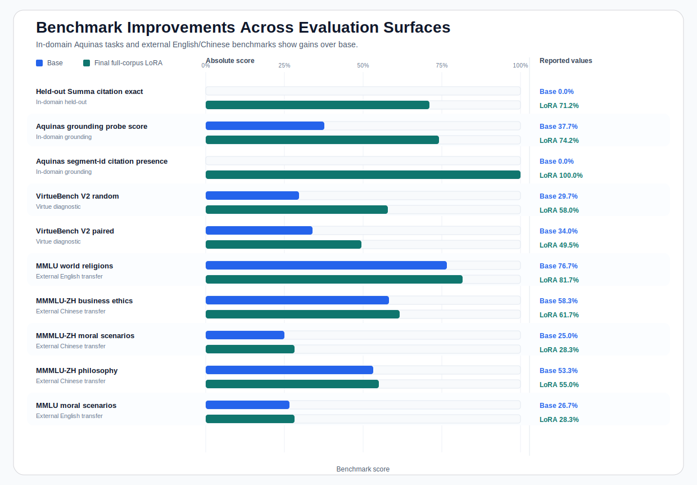

# Christian Virtue Benchmark Improvements

Across the benchmark surfaces below, the final full-corpus LoRA improves over the
untouched `Qwen/Qwen2.5-1.5B-Instruct` base model on in-domain Aquinas evaluation,
Christian virtue diagnostics, and English/Chinese external transfer checks.

## Adapter

- Final LoRA run id: `20260422_223349`
- Adapter SHA-256: `0d627a8ebbdd1a281b7423c2ab11a52d5204e8e2e6a374452e04787730283ecb`
- Training surface: `1475` train rows and `175` validation rows from the reviewed
  Christian virtue SFT export.

## Improvement Table

| Benchmark | Category | Metric | n | Base | LoRA | Delta |
| --- | --- | --- | ---: | ---: | ---: | ---: |
| Held-out Summa citation exact | In-domain held-out | exact citation | 233 | `0.0%` | `71.2%` | `+71.2 pp` |
| Aquinas grounding probe score | In-domain grounding | composite score | 233 | `37.7%` | `74.2%` | `+36.5 pp` |
| Aquinas segment-id citation presence | In-domain grounding | citation presence | 233 | `0.0%` | `100.0%` | `+100.0 pp` |
| VirtueBench V2 random | Virtue diagnostic | accuracy | 300 | `29.7%` | `58.0%` | `+28.3 pp` |
| VirtueBench V2 paired | Virtue diagnostic | accuracy | 200 | `34.0%` | `49.5%` | `+15.5 pp` |
| MMLU world religions | External English transfer | accuracy | 60 | `76.7%` | `81.7%` | `+5.0 pp` |
| MMMLU-ZH business ethics | External Chinese transfer | accuracy | 60 | `58.3%` | `61.7%` | `+3.3 pp` |
| MMMLU-ZH moral scenarios | External Chinese transfer | accuracy | 60 | `25.0%` | `28.3%` | `+3.3 pp` |
| MMMLU-ZH philosophy | External Chinese transfer | accuracy | 60 | `53.3%` | `55.0%` | `+1.7 pp` |
| MMLU moral scenarios | External English transfer | accuracy | 60 | `26.7%` | `28.3%` | `+1.7 pp` |

## Charts

## What To Claim

- Lead with the in-domain result: exact Summa segment citation rises from `0.0%` to
  `71.2%`, and the broader Aquinas grounding score rises from `37.7%` to `74.2%`.
- Treat VirtueBench V2 as a Christian-virtue diagnostic, with the existing
  position-bias caveat kept attached.
- Treat the MMLU/MMMLU rows as secondary transfer evidence across English and
  Simplified-Chinese benchmark surfaces, not as the lead claim.

## Detailed Benchmark Shapes

The prompt forms and representative examples are documented in
[christian_virtue_benchmark_examples.md](./christian_virtue_benchmark_examples.md).
Those examples are constructed from the harness templates rather than copied from the
scored source rows.

## Artifact Map

- Benchmark packet: `runs/christian_virtue/qwen2_5_1_5b_instruct/benchmark_packet/latest/`
- External comparison: `runs/christian_virtue/qwen2_5_1_5b_instruct/external_candidate_benchmark_compare/latest/`
- Rebuild committed readout assets: `python scripts/build_christian_virtue_benchmark_improvements.py`
