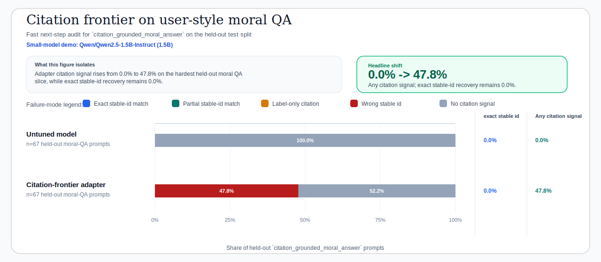

# Christian Virtue Citation Frontier Audit

## Why This Is The Next Step

The current local 1.5B baseline already demonstrates real Thomist virtue alignment on virtue-concept and reviewed-relation tasks. The next logical expansion is therefore not more doctrinal scope. It is the narrow frontier that still blocks the assistant from feeling complete: `citation_grounded_moral_answer` on held-out user-style prompts.

This audit is intentionally fast. It reuses the canonical base and adapter predictions, runs in seconds, and tells us where the next under-five-hour local experiment should focus.

## Canonical Scope

- Split: `test`
- Target task family: `citation_grounded_moral_answer`
- Dataset: `data/processed/sft/exports/christian_virtue_v1`
- Base predictions: `runs/christian_virtue/qwen2_5_1_5b_instruct/base_test/20260420_162346/predictions.jsonl`
- Adapter predictions: `runs/christian_virtue/qwen2_5_1_5b_instruct/adapter_test/20260420_190542/predictions.jsonl`

## Core Readout

| Model | Count | Exact stable id | Any citation signal | Label-only citation | Wrong stable id | No citation signal |
| --- | ---: | ---: | ---: | ---: | ---: | ---: |
| Base | `67` | `0.0%` | `0.0%` | `0.0%` | `0.0%` | `100.0%` |
| Adapter | `67` | `0.0%` | `40.3%` | `0.0%` | `40.3%` | `59.7%` |

*Figure. Base-vs-adapter citation behavior on the hardest user-style moral QA slice. The key question is not whether the model can sound Thomistic; it is whether it can recover the right stable passage id when asked in natural language.*

Key takeaway:

- The adapter has already learned a meaningful amount of citation-seeking behavior on this hard slice.
- But the remaining failures are mostly retrieval and citation-format failures, not evidence-scope failures.
- So the next experiment should target citation recovery within the same virtue dataset, not broader corpus expansion.

## Adapter By Tract

| Tract | Count | Exact stable id | Any citation signal | No citation signal |
| --- | ---: | ---: | ---: | ---: |
| Fortitude parts (II-II qq.129-135) | `16` | `0.0%` | `18.8%` | `81.2%` |
| Justice core | `12` | `0.0%` | `66.7%` | `33.3%` |
| Prudence | `12` | `0.0%` | `25.0%` | `75.0%` |
| Temperance (II-II qq.141-160) | `12` | `0.0%` | `33.3%` | `66.7%` |
| Fortitude closure (II-II qq.136-140) | `5` | `0.0%` | `80.0%` | `20.0%` |
| Theological virtues | `5` | `0.0%` | `20.0%` | `80.0%` |
| Temperance closure (II-II qq.161-170) | `3` | `0.0%` | `100.0%` | `0.0%` |
| Connected virtues (II-II qq.109-120) | `2` | `0.0%` | `50.0%` | `50.0%` |

## Adapter By Relation Type

| Relation type | Count | Any citation signal | Wrong stable id | No citation signal |
| --- | ---: | ---: | ---: | ---: |
| `subjective_part_of` | `8` | `12.5%` | `12.5%` | `87.5%` |
| `treated_in` | `8` | `25.0%` | `25.0%` | `75.0%` |
| `requires_restitution` | `6` | `83.3%` | `83.3%` | `16.7%` |
| `concerns_great_expenditure` | `5` | `20.0%` | `20.0%` | `80.0%` |
| `concerns_great_work` | `5` | `20.0%` | `20.0%` | `80.0%` |
| `directed_to` | `5` | `80.0%` | `80.0%` | `20.0%` |
| `has_act` | `5` | `40.0%` | `40.0%` | `60.0%` |
| `species_of` | `4` | `75.0%` | `75.0%` | `25.0%` |
| `potential_part_of` | `3` | `100.0%` | `100.0%` | `0.0%` |
| `contrary_to` | `2` | `0.0%` | `0.0%` | `100.0%` |

## Representative Failure Modes

### Wrong Stable Id

#### christian_virtue_v1.citation_grounded_moral_answer.ann.concept-adams-first-sin-tempted-by-concept-first-parents-temptation-st-ii-ii-q165-a002-resp

- Tract: Temperance closure (II-II qq.161-170)
- Relation type: `tempted_by`
- User question: What does Aquinas teach about the relation between Adam's First Sin and Temptation of the First Parents?
- Reference ids: `st.ii-ii.q165.a002.resp`
- Base category: `no_citation_signal`
- Adapter category: `wrong_stable_id`

Base prediction:

> According to Thomas Aquinas, the relation between Adam's First Sin and the Temptation of the First Parents is a central theme in his moral philosophy. Aquinas distinguishes between the original sin of Adam and the subsequent temptation of Eve and Adam by the serpent. He argues that the original sin of Adam was a breach of the first commandment, which prohibits idolatry and the worship of created things. This origina…

Adapter prediction:

> According to the cited passage, Adam's First Sin is the original sin, which is the first sin of the human race. This is explicitly stated in ST I-II qq.100-101 a.1 resp. The passage states this directly in the cited passage. Citations: - st.ii-ii.q100.a001.resp (II-II q.100 a.1 resp)

#### christian_virtue_v1.citation_grounded_moral_answer.ann.concept-charity-has-act-concept-fraternal-correction-st-ii-ii-q033-a001-resp

- Tract: Theological virtues
- Relation type: `has_act`
- User question: According to Aquinas, what act belongs to Charity?
- Reference ids: `st.ii-ii.q033.a001.resp`
- Base category: `no_citation_signal`
- Adapter category: `wrong_stable_id`

Base prediction:

> According to Aquinas, the act of Charity, which is one of the theological virtues, is the act of loving God with one's whole self. This love is not merely intellectual but also involves the will and the whole person. Aquinas describes this love as "the most perfect form of love" and emphasizes its centrality in Christian life. The passage that discusses this is found in his Summa Theologica, specifically in the Seco…

Adapter prediction:

> According to Aquinas, Charity belongs to the act of Generosity. Citations: - st.ii-ii.q001.a001.resp (II-II q.1 a.1 resp)

### Label-Only Citation

- None in this run.

### No Citation Signal

#### christian_virtue_v1.citation_grounded_moral_answer.ann.concept-abstinence-subjective-part-of-concept-temperance-st-ii-ii-q143-a001-resp

- Tract: Temperance (II-II qq.141-160)
- Relation type: `subjective_part_of`
- User question: How does Aquinas classify Abstinence within Temperance?
- Reference ids: `st.ii-ii.q143.a001.resp`
- Base category: `no_citation_signal`
- Adapter category: `no_citation_signal`

Base prediction:

> According to Thomas Aquinas, abstinence is a form of temperance. Aquinas classifies abstinence under the broader category of "moderation" (moderatio) within his moral philosophy. He defines temperance as the "moderation of the appetites" (Summa Theologica, I, q. 100, a. 1). Abstinence, as a form of temperance, involves the restraint of one's desires or appetites in order to maintain a balanced state of life. Aquinas…

Adapter prediction:

> According to Aquinas, Abstinence is classified as a moral virtue under Temperance. The relevant passage is ST I-II qq.127-128.1.1. Here is the cited passage: ST I-II qq.127-128.1.1. (II-II qq.127-128 p.258 a.1 resp. II-II qq.127-128.1.1) Temperantia: II-II qq.127-128 (II-II qq.127-128 p.258 a.1 resp. II-II qq.127-128.1.1) Temperance is a moral virtue, and is divided into two species, namely, temperance of the body a…

#### christian_virtue_v1.citation_grounded_moral_answer.ann.concept-chastity-subjective-part-of-concept-temperance-st-ii-ii-q143-a001-resp

- Tract: Temperance (II-II qq.141-160)
- Relation type: `subjective_part_of`
- User question: How does Aquinas classify Chastity within Temperance?
- Reference ids: `st.ii-ii.q143.a001.resp`
- Base category: `no_citation_signal`
- Adapter category: `no_citation_signal`

Base prediction:

> Aquinas classifies chastity within the category of temperance. According to his moral philosophy, temperance is the virtue that moderates the appetites and desires, ensuring that they are used in moderation and in accordance with reason. Chastity, which refers to the virtue of self-control and abstinence from sexual intercourse outside of marriage, is specifically discussed in relation to temperance. Aquinas states…

Adapter prediction:

> According to Aquinas, chastity is classified as a temperance virtue. The passage that supports this is ST I-II qq.112-113 art.2 resp. (ST I-II qq.112-113 art.2 resp.). The passage states: "Chastity is a temperance, because it is a virtue of the will, and temperance is a virtue of the will." The passage cites ST I-II qq.112-113 art.2 resp. (ST I-II qq.112-113 art.2 resp.) for this classification.

## Final Next-Step Thesis

The next expansion should target citation-grounded moral answers rather than widening doctrinal scope, because the current local baseline already shows strong virtue-concept and reviewed-relation gains while this user-style task remains the main unresolved traceability bottleneck.

The concrete next local expansion should therefore be:

- keep the current local-baseline as the public virtue-reasoning demo
- rerun this frontier audit after any focused mixture change
- treat stable-id recovery on citation_grounded_moral_answer as the next local success criterion

## Recommended Citation-Frontier Recipe

Keep the Christian virtue dataset fixed and strengthen the local recipe only through a more citation-heavy but still mixed small-run subset.

- Training config: `configs/train/qwen2_5_1_5b_instruct_lora_mps_citation_frontier.yaml`
- Adapter inference config: `configs/inference/qwen2_5_1_5b_instruct_citation_frontier_adapter_test.yaml`
- Max steps: `20`
- Max train examples: `128`
- Max eval examples: `32`
- Train task quotas: `citation_grounded_moral_answer=64`, `reviewed_relation_explanation=24`, `virtue_concept_explanation=24`, `passage_grounded_doctrinal_qa=16`
- Eval task quotas: `citation_grounded_moral_answer=16`, `reviewed_relation_explanation=8`, `virtue_concept_explanation=4`, `passage_grounded_doctrinal_qa=4`

Suggested command sequence:

- `make train-christian-virtue-qwen2-5-1-5b-citation-frontier`
- `make eval-christian-virtue-qwen2-5-1-5b-citation-frontier-test`
- `make compare-christian-virtue-qwen2-5-1-5b-citation-frontier`
- `make audit-christian-virtue-qwen2-5-1-5b-citation-frontier`

This recipe keeps the same small-model local budget as the canonical baseline, but it puts half of the train subset on citation-grounded moral answers while preserving relation, concept, and passage-grounded anchors. That makes it the cleanest next experiment if the goal is better Thomist virtue behavior with stronger stable-id traceability.

That is the cleanest expansion of this research program: keep the dataset fixed, keep the Thomist virtue target fixed, and push the next fast loop directly at the remaining citation-retrieval bottleneck.
