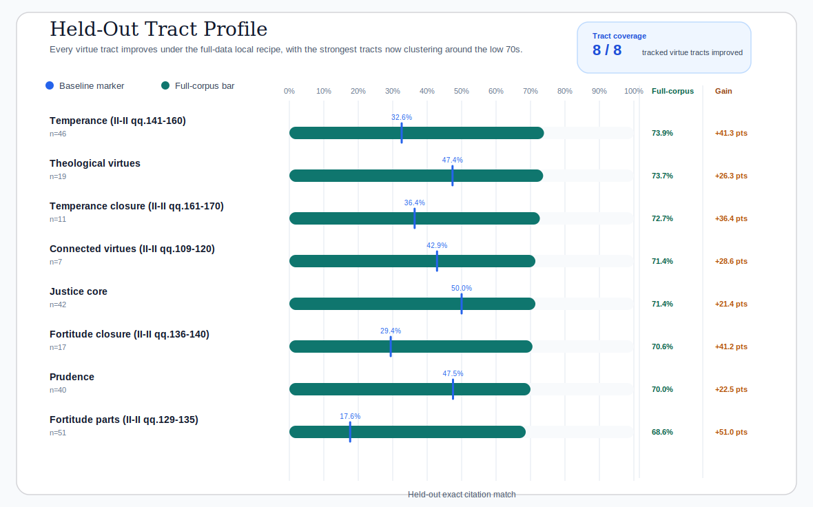
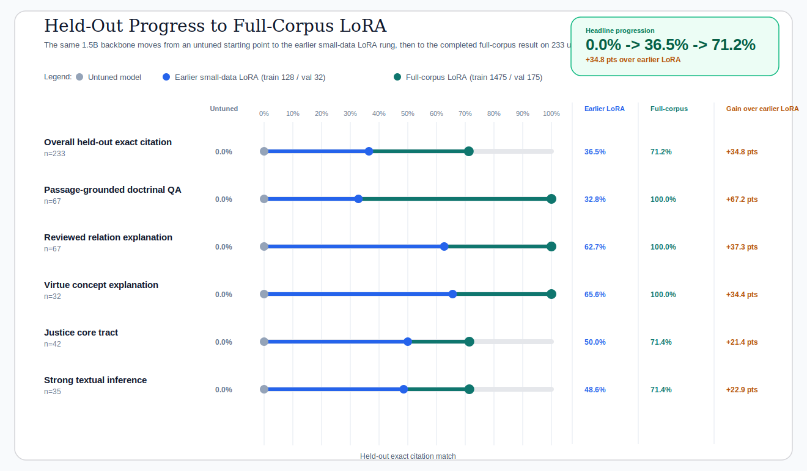

# Christian Virtue Experiments

## Purpose

This index tracks the public experiment story that the repo currently foregrounds.

Raw `runs/` artifacts stay out of the committed repo by default. The entries here are the
reader-facing checkpoints that explain the current dataset, method, strongest result, and release
surface without forcing a reviewer to reconstruct the story from terminal logs.

Public first-use links:

- online chat:
  [jennyzhu0822-summa-virtue-chat.hf.space](https://jennyzhu0822-summa-virtue-chat.hf.space)
- Hugging Face adapter:
  [JennyZhu0822/summa-virtue-qwen2.5-1.5b](https://huggingface.co/JennyZhu0822/summa-virtue-qwen2.5-1.5b)
- companion graph viewer:
  [summa-moral-graph.streamlit.app](https://summa-moral-graph.streamlit.app/)

## Current Flagship Result

### Qwen2.5 1.5B Full-Corpus LoRA

This is the strongest repo-local Christian virtue result currently documented in the project.

- Report:
  [christian_virtue_qwen2_5_1_5b_full_corpus_report.md](./christian_virtue_qwen2_5_1_5b_full_corpus_report.md)
- Dataset card:
  [../christian_virtue_dataset_card.md](../christian_virtue_dataset_card.md)
- Public fine-tune guide:
  [../fine_tune_with_summa_moral_graph.md](../fine_tune_with_summa_moral_graph.md)

Completed repo-local run ids:

- untuned-model eval: `20260420_162346`
- full-corpus train: `20260422_223349`
- full-corpus adapter test: `20260423_011453`

What it demonstrates:

- overall held-out exact citation rises from `0.0%` to `71.2%`
- `passage_grounded_doctrinal_qa` reaches `100.0%`
- `reviewed_relation_explanation` reaches `100.0%`
- `virtue_concept_explanation` reaches `100.0%`
- `justice_core` reaches `71.4%`

This is the clearest repo-local demonstration that the reviewed Christian virtue dataset can teach
strong Aquinas-grounded doctrinal and explanatory behavior on held-out evaluation once the model
sees the full reviewed training surface.

### Quick Read



The tract profile comes first because it is the fastest way to see that the result is broad rather
than concentrated in one tract. All eight tracked virtue tracts now sit in a narrow, strong band
on the held-out test split.



The second public figure shows the full improvement ladder: untouched model, earlier small-data
LoRA rung (`train 128 / val 32`), and the completed full-corpus LoRA run (`train 1475 / val 175`).

| Held-out virtue slice | Untuned model | Earlier small-data LoRA | Full-corpus LoRA | Gain over earlier LoRA |
| --- | ---: | ---: | ---: | ---: |
| Overall exact citation | `0.0%` | `36.5%` | `71.2%` | `+34.8 pts` |
| Passage-grounded doctrinal QA | `0.0%` | `32.8%` | `100.0%` | `+67.2 pts` |
| Reviewed relation explanation | `0.0%` | `62.7%` | `100.0%` | `+37.3 pts` |
| Virtue concept explanation | `0.0%` | `65.6%` | `100.0%` | `+34.4 pts` |
| Justice core tract | `0.0%` | `50.0%` | `71.4%` | `+21.4 pts` |

Canonical rerun command:

```bash
make run-christian-virtue-qwen2-5-1-5b-full-corpus-loop
```

Curated report rebuild:

```bash
make report-christian-virtue-qwen2-5-1-5b-full-corpus
```

## Public Release Artifact

The repo also ships a smaller public adapter package for readers who want the lightest release
surface:

- Hugging Face adapter:
  [JennyZhu0822/summa-virtue-qwen2.5-1.5b](https://huggingface.co/JennyZhu0822/summa-virtue-qwen2.5-1.5b)
- Matching GitHub release:
  [christian-virtue-qwen2.5-1.5b-local-baseline-20260418_193038](https://github.com/hanzhenzhujene/summa-virtue-alignment/releases/tag/christian-virtue-qwen2.5-1.5b-local-baseline-20260418_193038)
- Local adapter package mirror:
  [../../artifacts/christian_virtue/qwen2_5_1_5b_instruct/local_baseline_adapter/README.md](../../artifacts/christian_virtue/qwen2_5_1_5b_instruct/local_baseline_adapter/README.md)

That public package is intentionally smaller than the full-corpus repo-local result. It exists as
the lightest reproducible release artifact, while the full-corpus report above is the strongest
current local result.
