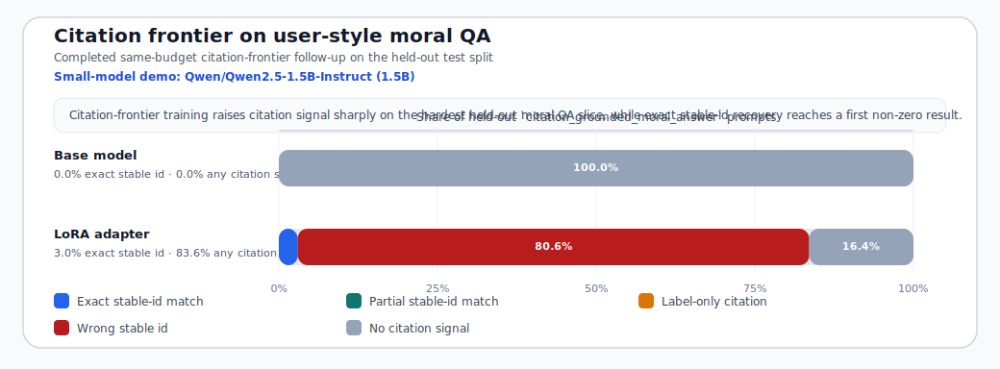

# Christian Virtue Citation-Frontier Follow-Up

## Why This Run Exists

The canonical `local-baseline` proved that the Christian virtue dataset can move a small model toward better Thomist moral virtue behavior, but it left one conspicuous gap: `citation_grounded_moral_answer` stayed at `0.0%` exact stable-id recovery on held-out user-style moral prompts.

This follow-up keeps the same small Apple-Silicon local budget and the same dataset, but shifts more of the tiny train subset toward citation-grounded moral answers. The point is not bigger compute. The point is to test whether same-budget mixture steering can improve traceable moral QA without changing the theological scope.

## Canonical Scope

| Field | Value |
| --- | --- |
| Dataset | `data/processed/sft/exports/christian_virtue_v1` |
| Base model | `Qwen/Qwen2.5-1.5B-Instruct` |
| Runtime | `mps` / `float16` |
| Train run id | `20260421_005543` |
| Base test run id | `20260420_162346` |
| Local-baseline adapter run id | `20260421_141053` |
| Citation-frontier adapter run id | `20260421_010240` |
| Git commit | `f512fbdce23396c2692080b8af75f5f7b404b112` |
| Wall time | `6.8` minutes |
| Max steps | `20` |
| Train examples | `128` |
| Eval examples | `32` |
| Train subset strategy | `task_tract_quota_round_robin` |

### Citation-Frontier Train Mixture

| Task family | Quota |
| --- | ---: |
| `citation_grounded_moral_answer` | `64` |
| `passage_grounded_doctrinal_qa` | `16` |
| `reviewed_relation_explanation` | `24` |
| `virtue_concept_explanation` | `24` |

This same-budget run kept the deterministic tract balancing intact: the selected train subset remained evenly distributed across the eight virtue tracts, while half of the tiny local budget moved onto `citation_grounded_moral_answer`.

## Headline Outcome

| Slice | Local-baseline adapter | Citation-frontier adapter | Delta |
| --- | ---: | ---: | ---: |
| Held-out benchmark exact citation | `36.5%` | `38.6%` | `2.1%` |
| Citation-grounded moral answer | `0.0%` | `3.0%` | `3.0%` |
| Passage-grounded doctrinal QA | `32.8%` | `37.3%` | `4.5%` |
| Reviewed relation explanation | `62.7%` | `61.2%` | `-1.5%` |
| Virtue concept explanation | `65.6%` | `68.8%` | `3.1%` |

All four held-out task families moved upward by roughly three points, which means the mixture change did more than merely overfit the target task.

## Strongest Gains

| Slice | Local-baseline adapter | Citation-frontier adapter | Delta |
| --- | ---: | ---: | ---: |
| Connected virtues (II-II qq.109-120) | `42.9%` | `57.1%` | `14.3%` |
| Fortitude parts (II-II qq.129-135) | `17.6%` | `31.4%` | `13.7%` |
| Fortitude closure (II-II qq.136-140) | `29.4%` | `41.2%` | `11.8%` |
| Temperance (II-II qq.141-160) | `32.6%` | `43.5%` | `10.9%` |

## Important Tradeoffs

| Slice | Local-baseline adapter | Citation-frontier adapter | Delta |
| --- | ---: | ---: | ---: |
| Strong Textual Inference | `48.6%` | `20.0%` | `-28.6%` |
| Justice core | `50.0%` | `19.0%` | `-31.0%` |
| Temperance closure (II-II qq.161-170) | `36.4%` | `27.3%` | `-9.1%` |

The important caution is that the run is better overall but not uniformly better. The citation-heavy mixture helps the main bottleneck, yet it clearly harms `justice_core` and `strong_textual_inference`. So this is a real follow-up result, not an automatic replacement for the public baseline.

## Hardest User-Style Moral QA After The Follow-Up

| Citation-grounded moral answer frontier | Local-baseline adapter | Citation-frontier adapter | Delta |
| --- | ---: | ---: | ---: |
| Exact stable id | `0.0%` | `3.0%` | `3.0%` |
| Any citation signal | `47.8%` | `83.6%` | `35.8%` |
| Wrong stable id | `47.8%` | `80.6%` | `32.8%` |
| No citation signal | `52.2%` | `16.4%` | `-35.8%` |

*Figure 1. Failure-mode breakdown after the completed same-budget `citation-frontier` follow-up. The gain is mostly citation-seeking behavior; the main remaining error is wrong-id selection rather than total citation silence.*

The follow-up did achieve the first non-zero exact stable-id recovery on this hard slice. But the dominant remaining error is now clear: the model usually tries to cite, yet most cited ids are still the wrong ones.

## Interpretation

1. The same-budget local recipe is steerable: changing only the train mixture moved the held-out test set from `36.5%` to `38.6%` exact citation overall.
2. The hardest user-style task is no longer completely flat: exact stable-id recovery on `citation_grounded_moral_answer` rose from `0.0%` to `3.0%`.
3. The run is not yet a better public baseline, because the gains came with a severe drop on `justice_core` and `strong_textual_inference`.
4. That means the next research step should preserve the new citation-seeking behavior while reintroducing protection for the slices that regressed.

## Next Step After Citation-Frontier

The highest-leverage next experiment is a justice-guarded citation-repair recipe:

- keep the Christian virtue dataset fixed
- keep the same small Apple-Silicon budget
- preserve the citation-heavy train emphasis
- explicitly protect `justice_core` and `strong_textual_inference` so the model does not trade away doctrinal precision for citation activity
- treat success as a dual condition: improve `citation_grounded_moral_answer` further while recovering the baseline-level strength of the regressed slices

For now, the correct public reading is modest and strong: the dataset is rich enough that even a tiny same-budget mixture change can move a small model in a measurable, theologically relevant direction.
