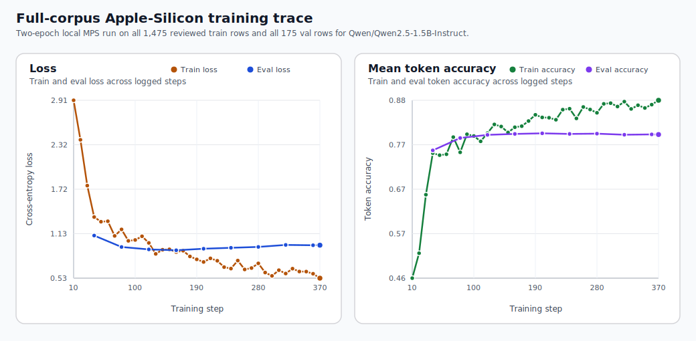

# Full-Corpus Christian Virtue LoRA Report

This report records the completed full-data Apple-Silicon run for the Christian virtue
SFT pipeline. The backbone stays fixed at `Qwen/Qwen2.5-1.5B-Instruct`, but the recipe
trains on all reviewed `train` rows (`1475`) and validates on all reviewed `val` rows
(`175`) before evaluating on the untouched `233`-row held-out `test` split.

This is the strongest repo-local Christian virtue result currently documented in the
project.

The report now puts the virtue-tract picture first, because broad tract strength is the
clearest first-read view of what the completed full-corpus run actually achieved.


*Figure 1. Held-out virtue tract profile after full-corpus LoRA. All eight tracked virtue
tracts now land between `68.6%` and `73.9%` exact citation on untouched test prompts.*


*Figure 2. Three-stage held-out progress on the strongest Christian virtue slices:
untuned model, the earlier small-data LoRA rung, and the completed full-corpus LoRA result.*



*Figure 3. Full-corpus Apple-Silicon training trace. Even at a much larger local budget,
the run stays stable on `mps` and reaches a clean final validation loss of `0.974`.*

## Executive Readout

- The held-out benchmark now progresses from `0.0%` on the untouched model to `36.5%` on the earlier small-data LoRA rung, then to `71.2%` on the completed full-corpus run.
- The strongest doctrinal and explanatory slices now all hit `100.0%`: `Passage-grounded doctrinal QA`, `Reviewed relation explanation`, and `Virtue concept explanation`.
- Relative to the earlier small-data LoRA rung, full-corpus LoRA adds `+34.8` points overall and raises `Justice core` from `50.0%` to `71.4%`.
- The earlier baseline used train 128 / val 32; the completed run uses train 1475 / val 175.

## Run Setup

| Field | Value |
| --- | --- |
| Model | `Qwen/Qwen2.5-1.5B-Instruct` |
| Untuned-model eval run | `20260420_162346` |
| Earlier small-data LoRA train run | `20260421_134712` |
| Earlier small-data LoRA adapter eval run | `20260421_141053` |
| Full-corpus train run | `20260422_223349` |
| Full-corpus adapter eval run | `20260423_011453` |
| Earlier small-data LoRA budget | `train 128 / val 32` |
| Full-corpus budget | `train 1475 / val 175` |
| Training duration | `158.9` minutes |
| Held-out test rows | `233` |
| Runtime | `mps` / `float16` |
| Train subset strategy | `task_tract_round_robin` |
| Eval subset strategy | `task_tract_round_robin` |
| Learning rate | `0.0001` |
| Num train epochs | `2.0` |
| Output dir | `runs/christian_virtue/qwen2_5_1_5b_instruct/full_corpus` |
| Earlier LoRA train metadata | `runs/christian_virtue/qwen2_5_1_5b_instruct/local_baseline/20260421_134712/train_metadata.json` |
| Full-corpus train metadata | `runs/christian_virtue/qwen2_5_1_5b_instruct/full_corpus/20260422_223349/train_metadata.json` |
| Untuned-model metrics | `runs/christian_virtue/qwen2_5_1_5b_instruct/base_test/20260420_162346/metrics.json` |
| Earlier LoRA metrics | `runs/christian_virtue/qwen2_5_1_5b_instruct/adapter_test/20260421_141053/metrics.json` |
| Full-corpus metrics | `runs/christian_virtue/qwen2_5_1_5b_instruct/full_corpus_adapter_test/20260423_011453/metrics.json` |

## Strong Held-Out Result Table

| Slice | Untuned model | Earlier small-data LoRA | Full-corpus LoRA | Gain over earlier LoRA |
| --- | ---: | ---: | ---: | ---: |
| Overall held-out exact citation | `0.0%` | `36.5%` | `71.2%` | `+34.8 pts` |
| Passage-grounded doctrinal QA | `0.0%` | `32.8%` | `100.0%` | `+67.2 pts` |
| Reviewed relation explanation | `0.0%` | `62.7%` | `100.0%` | `+37.3 pts` |
| Virtue concept explanation | `0.0%` | `65.6%` | `100.0%` | `+34.4 pts` |
| Justice core tract | `0.0%` | `50.0%` | `71.4%` | `+21.4 pts` |
| Strong textual inference | `0.0%` | `48.6%` | `71.4%` | `+22.9 pts` |

## Held-Out Tract Profile

| Tract | Full-corpus LoRA | Test rows |
| --- | ---: | ---: |
| Temperance (II-II qq.141-160) | `73.9%` | `46` |
| Theological virtues | `73.7%` | `19` |
| Temperance closure (II-II qq.161-170) | `72.7%` | `11` |
| Connected virtues (II-II qq.109-120) | `71.4%` | `7` |
| Justice core | `71.4%` | `42` |
| Fortitude closure (II-II qq.136-140) | `70.6%` | `17` |
| Prudence | `70.0%` | `40` |
| Fortitude parts (II-II qq.129-135) | `68.6%` | `51` |

## Why This Run Matters

- It makes the improvement story more concrete than the earlier small-data LoRA rung:
  the repo now shows a clear progression from untuned model to a small-data LoRA rung
  and then beyond that rung to the strongest full-corpus local result.
- It shows that the reviewed Christian virtue dataset scales far beyond the tiny
  `128`/`32` earlier-LoRA budget while staying fully local on Apple Silicon.
- It demonstrates that the dataset can teach stable doctrinal passage selection,
  relation explanation, and virtue-concept explanation extremely strongly once the
  model sees the whole reviewed training surface.
- It is therefore the clearest local proof in the repo that the Summa Moral Graph
  evidence model can support a serious Thomist virtue-alignment SFT loop, not just a
  smoke-test demonstration.

## Reproduce

```bash
make run-christian-virtue-qwen2-5-1-5b-full-corpus-loop
make report-christian-virtue-qwen2-5-1-5b-full-corpus
```

The report builder reads the comparison artifacts directly from:

```text
runs/christian_virtue/qwen2_5_1_5b_instruct/base_test/20260420_162346
runs/christian_virtue/qwen2_5_1_5b_instruct/local_baseline/20260421_134712
runs/christian_virtue/qwen2_5_1_5b_instruct/adapter_test/20260421_141053
runs/christian_virtue/qwen2_5_1_5b_instruct/full_corpus/20260422_223349
runs/christian_virtue/qwen2_5_1_5b_instruct/full_corpus_adapter_test/20260423_011453
```
