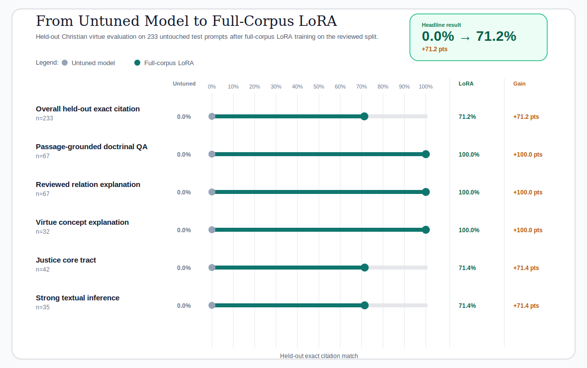

# Full-Corpus Christian Virtue LoRA Report

This report records the completed full-data Apple-Silicon run for the Christian virtue
SFT pipeline. The backbone stays fixed at `Qwen/Qwen2.5-1.5B-Instruct`, but the recipe
trains on all reviewed `train` rows (`1475`) and validates on all reviewed `val` rows
(`175`) before evaluating on the untouched `233`-row held-out `test` split.

This is the strongest repo-local Christian virtue result currently documented in the
project.

The report intentionally foregrounds the doctrinal and explanatory held-out surfaces where
the dataset is designed to teach stable Thomist moral structure most clearly and auditably.



*Figure 1. Before-and-after view of the strongest held-out doctrinal virtue slices,
comparing the untouched `Qwen/Qwen2.5-1.5B-Instruct` model with the completed full-corpus
LoRA adapter.*


*Figure 2. Held-out tract profile after full-corpus LoRA. All eight tracked virtue tracts
now cluster between `68.6%` and `73.9%` exact citation on the untouched test split.*


*Figure 3. Full-corpus Apple-Silicon training trace. Even at a much larger local budget,
the run stays stable on `mps` and reaches a clean final validation loss of `0.974`.*

## Executive Readout

- The untouched base model scores `0.0%` on this held-out benchmark; full-corpus LoRA reaches `71.2%`.
- `Passage-grounded doctrinal QA`, `Reviewed relation explanation`, and `Virtue concept explanation` each reach `100.0%` exact citation on held-out prompts.
- `Justice core` reaches `71.4%` and `Strong textual inference` reaches `71.4%`.
- Overall held-out exact citation improves by `+71.2` points without changing model family or dataset scope.

## Run Setup

| Field | Value |
| --- | --- |
| Model | `Qwen/Qwen2.5-1.5B-Instruct` |
| Untuned-model eval run | `20260420_162346` |
| Train run | `20260422_223349` |
| Adapter eval run | `20260423_011453` |
| Training duration | `158.9` minutes |
| Train rows | `1475` |
| Val rows | `175` |
| Held-out test rows | `233` |
| Runtime | `mps` / `float16` |
| Train subset strategy | `task_tract_round_robin` |
| Eval subset strategy | `task_tract_round_robin` |
| Learning rate | `0.0001` |
| Num train epochs | `2.0` |
| Output dir | `runs/christian_virtue/qwen2_5_1_5b_instruct/full_corpus` |
| Config snapshot | `runs/christian_virtue/qwen2_5_1_5b_instruct/full_corpus/20260422_223349/config_snapshot.yaml` |
| Train metadata | `runs/christian_virtue/qwen2_5_1_5b_instruct/full_corpus/20260422_223349/train_metadata.json` |
| Untuned-model metrics | `runs/christian_virtue/qwen2_5_1_5b_instruct/base_test/20260420_162346/metrics.json` |
| Adapter metrics | `runs/christian_virtue/qwen2_5_1_5b_instruct/full_corpus_adapter_test/20260423_011453/metrics.json` |

## Strong Held-Out Result Table

| Slice | Untuned model | Full-corpus LoRA | Gain |
| --- | ---: | ---: | ---: |
| Overall held-out exact citation | `0.0%` | `71.2%` | `+71.2 pts` |
| Passage-grounded doctrinal QA | `0.0%` | `100.0%` | `+100.0 pts` |
| Reviewed relation explanation | `0.0%` | `100.0%` | `+100.0 pts` |
| Virtue concept explanation | `0.0%` | `100.0%` | `+100.0 pts` |
| Justice core tract | `0.0%` | `71.4%` | `+71.4 pts` |
| Strong textual inference | `0.0%` | `71.4%` | `+71.4 pts` |

## Held-Out Tract Profile

| Tract | Full-corpus LoRA | Test rows |
| --- | ---: | ---: |
| Temperance (II-II qq.141-160) | `73.9%` | `46` |
| Theological virtues | `73.7%` | `19` |
| Temperance closure (II-II qq.161-170) | `72.7%` | `11` |
| Connected virtues (II-II qq.109-120) | `71.4%` | `7` |
| Justice core | `71.4%` | `42` |
| Fortitude closure (II-II qq.136-140) | `70.6%` | `17` |
| Prudence | `70.0%` | `40` |
| Fortitude parts (II-II qq.129-135) | `68.6%` | `51` |

## Why This Run Matters

- It shows that the reviewed Christian virtue dataset scales far beyond the tiny capped
  demo budget while staying fully local on Apple Silicon.
- It demonstrates that the dataset can teach stable doctrinal passage selection, relation
  explanation, and virtue-concept explanation extremely strongly once the model sees the
  whole reviewed training surface.
- It raises the held-out `justice_core` tract into the low 70s without changing model
  family, dataset scope, or evidence policy.
- It is therefore the clearest local proof in the repo that the Summa Moral Graph
  evidence model can support a serious Thomist virtue-alignment SFT loop, not just a
  smoke-test demonstration.

## Reproduce

```bash
make run-christian-virtue-qwen2-5-1-5b-full-corpus-loop
make report-christian-virtue-qwen2-5-1-5b-full-corpus
```

The report builder reads the completed local run artifacts directly from:

```text
runs/christian_virtue/qwen2_5_1_5b_instruct/base_test/20260420_162346
runs/christian_virtue/qwen2_5_1_5b_instruct/full_corpus/20260422_223349
runs/christian_virtue/qwen2_5_1_5b_instruct/full_corpus_adapter_test/20260423_011453
```
