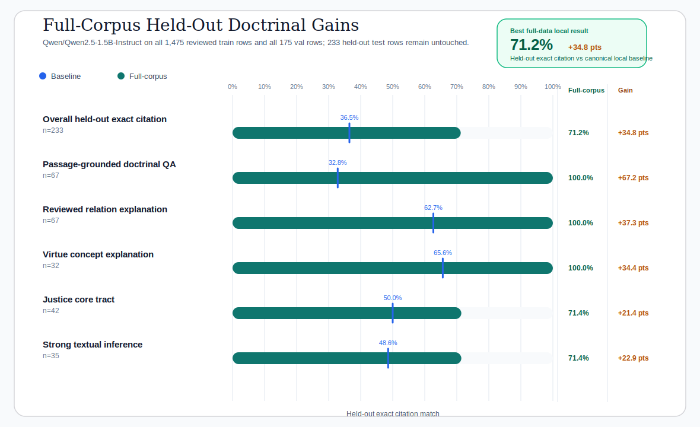

# Full-Corpus Local Christian Virtue Report

This report records the completed full-data local Apple-Silicon run for the Christian
virtue SFT pipeline. The backbone stays fixed at `Qwen/Qwen2.5-1.5B-Instruct`, but the
recipe now trains on all reviewed `train` rows (`1475`) and validates on all reviewed
`val` rows (`175`) before evaluating on the untouched `233`-row held-out `test` split.

It is now the strongest full-data local result in the repo.

This report foregrounds the repo's strongest doctrinal and explanatory held-out slices,
because those are the public demonstration surfaces the Christian virtue dataset is built
to teach and audit.



*Figure 1. The completed `full-corpus` run more than doubles the canonical
local-baseline held-out exact citation score and saturates the three structured
doctrinal and explanatory task families at `100.0%` exact citation on held-out prompts.*


*Figure 2. Tract-level held-out exact citation after training on the full reviewed split.
Every tract rises above the canonical baseline, with the strongest tracts now clustered
around the low 70s.*


*Figure 3. Full-corpus Apple-Silicon training trace. Even at a much larger local budget,
the run stays stable on `mps` and reaches a clean final validation loss of `0.974`.*

## Executive Readout

- Overall held-out exact citation reaches `71.2%`.
- Relative to the canonical `local-baseline`, that is a `+34.8` point gain.
- `Passage-grounded doctrinal QA`, `Reviewed relation explanation`, and `Virtue concept explanation` each reach `100.0%` exact citation on the held-out `test` split.
- `Justice core` rises from `50.0%` on the canonical baseline to `71.4%`.
- `Strong textual inference` rises from `48.6%` on the canonical baseline to `71.4%`.

## Run Setup

| Field | Value |
| --- | --- |
| Model | `Qwen/Qwen2.5-1.5B-Instruct` |
| Train run | `20260422_223349` |
| Adapter eval run | `20260423_011453` |
| Compare run | `20260423_015138` |
| Training duration | `158.9` minutes |
| Train rows | `1475` |
| Val rows | `175` |
| Held-out test rows | `233` |
| Runtime | `mps` / `float16` |
| Train subset strategy | `task_tract_round_robin` |
| Eval subset strategy | `task_tract_round_robin` |
| Learning rate | `0.0001` |
| Num train epochs | `2.0` |
| Output dir | `runs/christian_virtue/qwen2_5_1_5b_instruct/full_corpus` |
| Config snapshot | `runs/christian_virtue/qwen2_5_1_5b_instruct/full_corpus/20260422_223349/config_snapshot.yaml` |
| Train metadata | `runs/christian_virtue/qwen2_5_1_5b_instruct/full_corpus/20260422_223349/train_metadata.json` |
| Adapter metrics | `runs/christian_virtue/qwen2_5_1_5b_instruct/full_corpus_adapter_test/20260423_011453/metrics.json` |
| Compare report | `runs/christian_virtue/qwen2_5_1_5b_instruct/full_corpus_compare_test/20260423_015138/report.md` |

## Strong Held-Out Result Table

| Slice | Canonical local-baseline | Full-corpus | Delta |
| --- | ---: | ---: | ---: |
| Overall held-out exact citation | `36.5%` | `71.2%` | `+34.8 pts` |
| Passage-grounded doctrinal QA | `32.8%` | `100.0%` | `+67.2 pts` |
| Reviewed relation explanation | `62.7%` | `100.0%` | `+37.3 pts` |
| Virtue concept explanation | `65.6%` | `100.0%` | `+34.4 pts` |
| Justice core tract | `50.0%` | `71.4%` | `+21.4 pts` |
| Strong textual inference | `48.6%` | `71.4%` | `+22.9 pts` |

## Held-Out Tract Profile

| Tract | Canonical local-baseline | Full-corpus | Delta |
| --- | ---: | ---: | ---: |
| Temperance (II-II qq.141-160) | `32.6%` | `73.9%` | `+41.3 pts` |
| Theological virtues | `47.4%` | `73.7%` | `+26.3 pts` |
| Temperance closure (II-II qq.161-170) | `36.4%` | `72.7%` | `+36.4 pts` |
| Connected virtues (II-II qq.109-120) | `42.9%` | `71.4%` | `+28.6 pts` |
| Justice core | `50.0%` | `71.4%` | `+21.4 pts` |
| Fortitude closure (II-II qq.136-140) | `29.4%` | `70.6%` | `+41.2 pts` |
| Prudence | `47.5%` | `70.0%` | `+22.5 pts` |
| Fortitude parts (II-II qq.129-135) | `17.6%` | `68.6%` | `+51.0 pts` |

## Why This Run Matters

- It is the clearest evidence in the repo so far that the reviewed Christian virtue
  dataset scales beyond the tiny `128`-example demo budget while staying fully local
  on Apple Silicon.
- It shows that the dataset can teach stable doctrinal passage selection, relation
  explanation, and virtue-concept explanation very strongly once the model sees the
  whole reviewed training surface rather than a tiny capped subset.
- It raises the held-out `justice_core` tract into the low 70s without changing model
  family, dataset scope, or evidence policy.
- It is therefore the strongest local proof in the repo that the Summa Moral Graph
  evidence model can support a serious Thomist virtue-alignment SFT loop, not just a
  smoke-test demonstration.

## Reproduce

```bash
make run-christian-virtue-qwen2-5-1-5b-full-corpus-loop
make report-christian-virtue-qwen2-5-1-5b-full-corpus
```

The report builder reads the completed local run artifacts directly from:

```text
runs/christian_virtue/qwen2_5_1_5b_instruct/full_corpus/20260422_223349
runs/christian_virtue/qwen2_5_1_5b_instruct/full_corpus_adapter_test/20260423_011453
runs/christian_virtue/qwen2_5_1_5b_instruct/full_corpus_compare_test/20260423_015138
```
