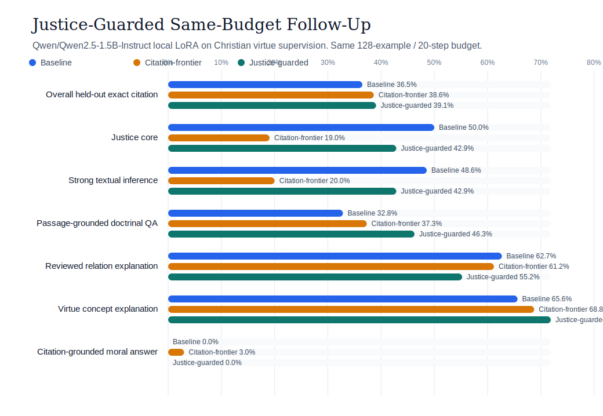

# Justice-Guarded Citation-Repair Report

This follow-up keeps the same tiny local `Qwen/Qwen2.5-1.5B-Instruct` budget as the
canonical baseline and the citation-frontier run, but adds four protected justice buckets
inside the deterministic subset selector. The result is the strongest same-budget overall
held-out exact citation score so far, while recovering most of the `justice_core` and
`strong_textual_inference` damage from the citation-frontier recipe.



*Figure 1. Same-budget comparison across the canonical baseline, the citation-frontier
follow-up, and the justice-guarded recipe. The justice-guarded run is the best overall
exact-citation configuration in this local 1.5B family, but it gives back the frontier's
small gain on `citation_grounded_moral_answer`.*

## Setup

| Field | Value |
| --- | --- |
| Model | `Qwen/Qwen2.5-1.5B-Instruct` |
| Train run | `20260421_153842` |
| Adapter eval run | `20260421_155616` |
| Training duration | `17.2` minutes |
| Train subset strategy | `task_tract_quota_round_robin` |
| Eval subset strategy | `task_tract_quota_round_robin` |
| Train quotas | `{"citation_grounded_moral_answer": 50, "passage_grounded_doctrinal_qa": 26, "reviewed_relation_explanation": 28, "virtue_concept_explanation": 24}` |
| Protected buckets | `4` justice-specific reservations |
| Config snapshot | `runs/christian_virtue/qwen2_5_1_5b_instruct/justice_guarded_citation_repair/20260421_153842/config_snapshot.yaml` |
| Train metadata | `runs/christian_virtue/qwen2_5_1_5b_instruct/justice_guarded_citation_repair/20260421_153842/train_metadata.json` |
| Adapter metrics | `runs/christian_virtue/qwen2_5_1_5b_instruct/justice_guarded_citation_repair_adapter_test/20260421_155616/metrics.json` |

## Result Table

| Slice | Baseline | Citation-frontier | Justice-guarded |
| --- | ---: | ---: | ---: |
| Overall held-out exact citation | `36.5%` | `38.6%` | `39.1%` |
| Justice core | `50.0%` | `19.0%` | `42.9%` |
| Strong textual inference | `48.6%` | `20.0%` | `42.9%` |
| Passage-grounded doctrinal QA | `32.8%` | `37.3%` | `46.3%` |
| Reviewed relation explanation | `62.7%` | `61.2%` | `55.2%` |
| Virtue concept explanation | `65.6%` | `68.8%` | `71.9%` |
| Citation-grounded moral answer | `0.0%` | `3.0%` | `0.0%` |

## What Changed

- Overall held-out exact citation improved from `36.5%` on the canonical baseline and
  `38.6%` on citation-frontier to `39.1%` here.
- `justice_core` recovered from the frontier collapse (`19.0%`) to `42.9%`, which is much
  closer to the canonical baseline (`50.0%`).
- `strong_textual_inference` recovered from `20.0%` on citation-frontier to `42.9%`, again
  much closer to the canonical baseline (`48.6%`).
- The biggest new gain is `passage_grounded_doctrinal_qa`, which reached `46.3%` exact
  citation compared with `32.8%` on the baseline and `37.3%` on citation-frontier.
- `virtue_concept_explanation` also improved to `71.9%`, the strongest same-budget result
  in this local 1.5B series.

## What It Did Not Fix

- `citation_grounded_moral_answer` fell back to `0.0%` exact stable-id recovery after the
  frontier recipe's small `3.0%` gain.
- `reviewed_relation_explanation` dropped from the canonical baseline's `62.7%` to `55.2%`.
- The successful rerun used explicit MPS env overrides
  (`PYTORCH_ENABLE_MPS_FALLBACK=1`, `PYTORCH_MPS_HIGH_WATERMARK_RATIO=0.0`) after an earlier
  MPS kernel stall, so this result is reproducible but not yet a cleaner public default than
  `local-baseline`.

## Interpretation

This justice-guarded recipe is a meaningful same-budget follow-up, not just a safer frontier
variant. It demonstrates that the subset selector can be taught to protect doctrinally
important justice/STI slices while still moving the overall held-out benchmark upward.
But it also shows that the repo's hardest remaining problem is still user-style moral QA with
stable passage-id recovery. The next research step is therefore an accuracy-first hybrid recipe that keeps
the justice guard while restoring at least some of the frontier's `citation_grounded_moral_answer` gain.
That next follow-up is now documented in the [Accuracy-first hybrid report](./christian_virtue_qwen2_5_1_5b_accuracy_first_hybrid_report.md).

## Reproduce

```bash
make run-christian-virtue-qwen2-5-1-5b-justice-guarded-loop
```

The official justice-guarded wrapper now exports the required MPS safety env
overrides automatically before training and adapter evaluation.
